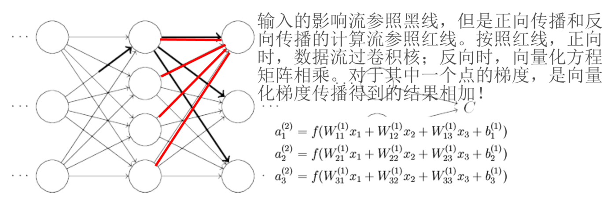

> 查看公式请安装插件[GitHub with MathJax](https://chrome.google.com/webstore/detail/github-with-mathjax/ioemnmodlmafdkllaclgeombjnmnbima)
<!-- TOC -->

- [简单表达式和理解梯度](#简单表达式和理解梯度)
- [复合表达式，链式法则，反向传播](#复合表达式链式法则反向传播)
- [梯度回传流](#梯度回传流)

<!-- /TOC -->
### 简单表达式和理解梯度
问题陈述：核心问题是：给定函数$f(x)$，其中x是输入数据的向量，需要计算函数f关于x的梯度，也就是$\nabla f(x)$。在神经网络中f对应的是损失函数 $L$ ，输入x里面包含训练数据、权重W和偏差b。一般为了参数更新，只计算参数（比如W、b）的梯度，有时为可视化神经网络会计算 $x_i$ 的梯度。

简单认知：对于$f=wx+b$，有$\frac{df}{dx}=w$、$\frac{df}{dw}=x$、$\frac{df}{db}=1$，其中$f$和$df$的维度相同并以此类推于其他变量，函数关于每个变量的导数指明了整个表达式对于该变量的敏感程度。

### 复合表达式，链式法则，反向传播
在神经网络中，会有许多复合表达式，采用链式法则求输入量的梯度，这个过程称为反向传播。

设$net_j$是节点 $j$ 的加权输入，$a_j$ 为激活输出，$E_d$为目标函数，则

$$\frac{\partial{E_d}}{\partial{w_{ji}}}=\frac{\partial{E_d}}{\partial{net_j}}\frac{\partial{net_j}}{\partial{w_{ji}}}=\frac{\partial{E_d}}{\partial{net_j}}x_{ji}$$

关键在于$\frac{\partial{E_d}}{\partial{net_j}}$的推导，引入误差项$\delta_j=\frac{\partial{E_d}}{\partial{net_j}}$，使用链式法则可得：

$$\delta_j=\delta_{j+1}w_{j+1j}f'(a_j)$$

根据以上公式将梯度逐步传递。

直观理解：门单元将反向传回的梯度乘以它对其的输入的局部梯度，从而得到整个网络的输出对该门单元的每个输入值的梯度。

模块化与分段计算：门单元是相对的，任何可微分的函数都可以看做门单元。为了计算方便，可以将多个门组合成一个门，也可以根据需要将一个函数分拆成多个门。

注意：
对前向传播变量进行缓存
在不同分支的梯度要相加

### 梯度回传流
加法门单元把输出的梯度相等地分发给它所有的输入

Max门单元对梯度做路由，选出在前向传播中值最大路径回传梯度

乘法门单元相对不容易解释但很重要。它的局部梯度就是相互交换后的输入值，然后根据链式法则乘以输出值的梯度。同时说明，数据的大小对于权重梯度的大小有影响。

向量化操作：层与层之间的交流是通过向量，但有的是Hadamard乘积，有的是矩阵相乘，分辨两种乘法以防混淆维度和转置操作。参照回传流图片：

其实数据前向传播和梯度反向传播，都属于卷积

附：结合《Neural Networks and Deep Learning-反向传播算法是如何工作的》学习，推荐阅读系列文章[神经网络和反向传播算法](https://www.zybuluo.com/hanbingtao/note/476663#零基础入门深度学习3-神经网络和反向传播算法)

