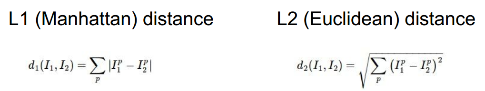

> 查看公式请安装插件[GitHub with MathJax](https://chrome.google.com/webstore/detail/github-with-mathjax/ioemnmodlmafdkllaclgeombjnmnbima)

[TOC]
### 1. 图像分类、数据驱动方法和流程
目标：已有固定的分类标签集合，对输入的图像，从分类标签集合中找出一个分类标签，最后把分类标签分配给该输入图像。

算法：给计算机很多数据，然后实现学习算法，让计算机学习到每个类的外形。这种方法，就是**数据驱动方法**。

流程:
- 收集图像和标签的数据集
- 使用机器学习算法训练出分类器
- 在测试集评估分类器的性能

### 2. Nearest Neighbor分类器
> 通过学习NN分类器，对于解决图像分类问题的方法有个基本的认识

简单描述：逐个像素比较，最后将像素差值全部加起来，据此来区分图像

实现：将两张图片先转化为两个向量（向量的维度为像素数量）$I_1$和$I_2$，再计算两者的距离$L_1$或者$L_2$（距离的选择是一个超参数），将距离最近的图像所对应的标签为输入图像对应的标签



改进：k-Nearest Neighbor分类器
找距离最近的k个图片的标签，让他们针对测试图片进行投票，把票数最高的标签作为对测试图片的预测。（k的取值是一个超参数）

代码套路：
``` python
import numpy as np

class NearestNeighbor(object):
  def __init__(self):
    pass

  def train(self, X, y):
    """ X is N x D where each row is an example. Y is 1-dimension of size N """
    # the nearest neighbor classifier simply remembers all the training data
    self.Xtr = X
    self.ytr = y

  def predict(self, X):
    """ X is N x D where each row is an example we wish to predict label for """
    num_test = X.shape[0]
    # lets make sure that the output type matches the input type
    Ypred = np.zeros(num_test, dtype = self.ytr.dtype)

    # loop over all test rows
    for i in xrange(num_test):
      # find the nearest training image to the i'th test image
      # using the L1 distance (sum of absolute value differences)
      distances = np.sum(np.abs(self.Xtr - X[i,:]), axis = 1)
      min_index = np.argmin(distances) # get the index with smallest distance
      Ypred[i] = self.ytr[min_index] # predict the label of the nearest example

    return Ypred
```

缺点：
* 测试要花费大量时间计算，因为每个测试图像需要和所有存储的训练图像进行比较
* 图像的分类是基于背景的，而不是图片的语义主体，不能止步于原始像素比较，得继续前进。

### 3. 验证集、交叉验证集和超参数调参
定义：k-NN分类器需要设定k值，或者选择不同的距离函数比如L1范数和L2范数，这些选择被称为超参数，为找到更合适的超参数，需要进行调优，综合比较不同的超参数。

如何设置超参数：超参数的取值因问题而定，只能通过尝试不同的值来综合比较。将原始训练集分为训练集和验证集，我们在验证集上尝试不同的超参数，最后保留表现最好那个。

代码套路：
``` python
    # assume we have Xtr_rows, Ytr, Xte_rows, Yte as before
    # recall Xtr_rows is 50,000 x 3072 matrix
    Xval_rows = Xtr_rows[:1000, :] # take first 1000 for validation
    Yval = Ytr[:1000]
    Xtr_rows = Xtr_rows[1000:, :] # keep last 49,000 for train
    Ytr = Ytr[1000:]
    
    # find hyperparameters that work best on the validation set
    validation_accuracies = []
    for k in [1, 3, 5, 10, 20, 50, 100]:
    
      # use a particular value of k and evaluation on validation data
      nn = NearestNeighbor()
      nn.train(Xtr_rows, Ytr)
      # here we assume a modified NearestNeighbor class that can take a k as input
      Yval_predict = nn.predict(Xval_rows, k = k)
      acc = np.mean(Yval_predict == Yval)
      print 'accuracy: %f' % (acc,)
    
      # keep track of what works on the validation set
      validation_accuracies.append((k, acc))
```

注意：
1. 不能使用测试集来进行调优
2. 从训练集中取出一部分数据用来调优，称之为验证集
3. 如果训练数据量不够，使用交叉验证方法，它能帮助我们在选取最优超参数的时候减少噪音。
