> 查看公式请安装插件[GitHub with MathJax](https://chrome.google.com/webstore/detail/github-with-mathjax/ioemnmodlmafdkllaclgeombjnmnbima)

<!-- TOC -->

- [RNN的应用](#rnn的应用)
- [RNN详细介绍](#rnn详细介绍)
    - [正向传播](#正向传播)
    - [反向传播](#反向传播)
    - [梯度爆炸和消失](#梯度爆炸和消失)
- [LSTM](#lstm)
    - [前向计算](#前向计算)
    - [定性理解避免梯度消失的原因](#定性理解避免梯度消失的原因)
- [GRU](#gru)
- [翻译系统](#翻译系统)

<!-- /TOC -->
### RNN的应用
RNN具有记忆功能，其输出与之前的状态和当前的输入有关，适合处理基于序列的数据。

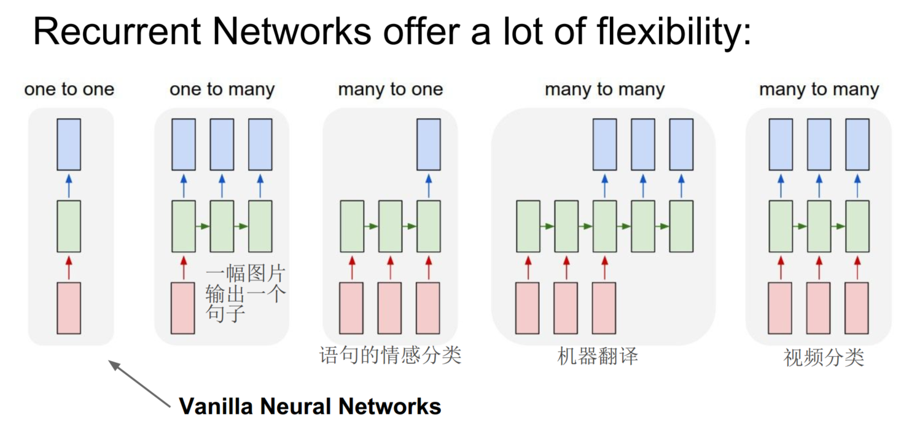

### RNN详细介绍
#### 正向传播
先看模型图片：

网络在t时刻接收到输入$x_t$之后，隐藏层的值是$s_t$，输出值是$o_t$。关键一点是，$s_t$的值不仅仅取决于$x_t$，还取决于$s_{t-1}$。公式如下：

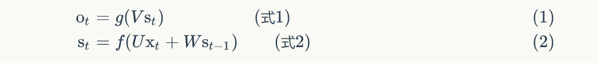

式1是输出层的计算公式，输出层是一个全连接层，也就是它的每个节点都和隐藏层的每个节点相连。$V$是输出层的权重矩阵，$g$是激活函数。式2是隐藏层的计算公式，它是循环层。$U$是输入$x$的权重矩阵，$W$是上一次的值$s_{t-1}$作为这一次的输入的权重矩阵，$f$是激活函数。

如果反复把式2带入到式1，我们将得到：

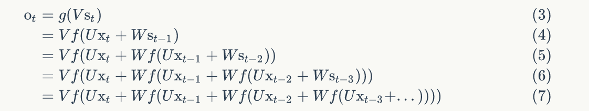

从上面可以看出，循环神经网络的输出值$o_t$，是受前面历次输入值$x_t$、$x_{t-1}$、$x_{t-2}$、$x_{t-3}$、...影响的，这就是为什么循环神经网络可以往前看任意多个输入值的原因。

此外为解决前后文有关联的序列，有双向循环神经网络，如下图：

堆叠两个以上的隐藏层则得到深度循环神经网络，如下图：

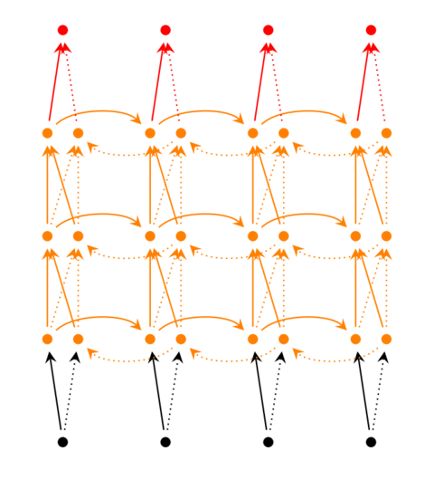

#### 反向传播

同样利用链式法则，梯度沿两个方向传播，一个方向是其传递到上一层网络，另一个是方向是将其沿时间线传递到初始时刻，相比CNN过程更加复杂。

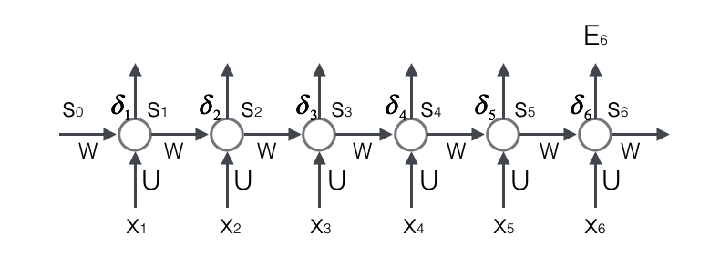

将误差项沿时间反向传播：

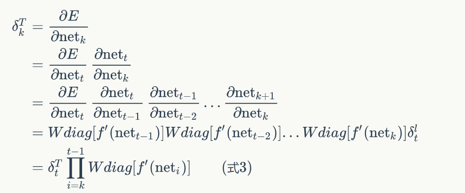

将误差项传递到上一层：

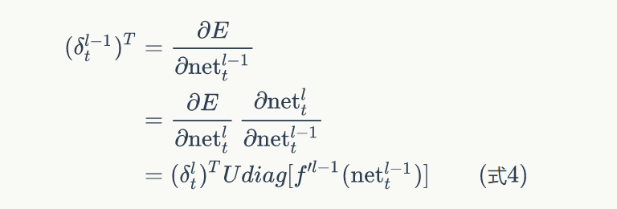

只要知道了任意一个时刻的误差项$\delta_t$，以及上一个时刻循环层的输出值$s_{t-1}$，就可以按照下面的公式求出权重矩阵在t时刻的梯度$\nabla_{W_t} E$：

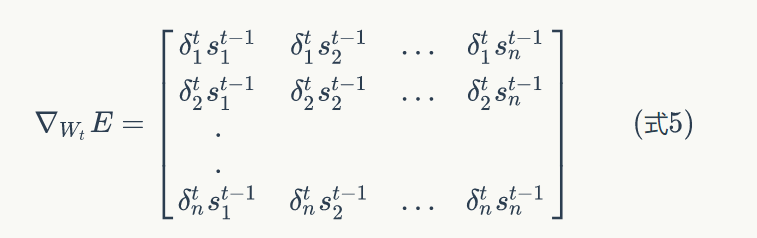

已经求得了权重矩阵W在t时刻的梯度，最终的梯度是各个时刻的梯度之和：

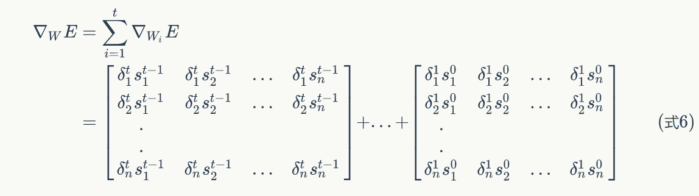

同权重矩阵W类似，我们可以求得权重矩阵U的梯度。

#### 梯度爆炸和消失
RNN在训练中很容易发生梯度爆炸和梯度消失，这导致训练时梯度不能在较长序列中一直传递下去，从而使RNN无法捕捉到长距离的影响。根据误差项的反向传播公式：

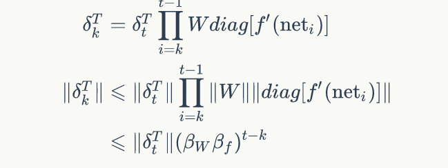

上式的定义$\beta$为矩阵的模的上界，如果t-k很大的话（也就是向前看很远的时候），会导致对应的误差项的值增长或缩小的非常快，这样就会导致相应的梯度爆炸和梯度消失问题（取决于$\beta$大于1还是小于1）。

通常来说，梯度爆炸更容易处理一些。因为梯度爆炸的时候，我们的程序会收到NaN错误；也可以设置一个梯度阈值，当梯度超过这个阈值的时候可以直接截取。

梯度消失更难检测，而且也更难处理一些。总的来说，我们有三种方法应对梯度消失问题：
- 合理的初始化权重值。初始化权重，使每个神经元尽可能不要取极大或极小值，以躲开梯度消失的区域。
- 使用relu代替sigmoid和tanh作为激活函数。
- 使用其他结构的RNNs，比如长短时记忆网络（LTSM）和Gated Recurrent Unit（GRU）

### LSTM
为解决原始RNN无法处理长距离依赖的问题，长短时记忆网络（LSTM）采用两种状态：h（对短期的输入敏感）、c（保存长期的状态），如下图：

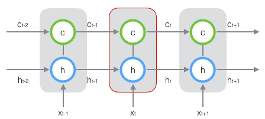

在t时刻，LSTM的输入有三个：当前时刻网络的输入值$x_t$、上一时刻LSTM的输出值$h_{t-1}$、以及上一时刻的单元状态$c_{t-1}$；LSTM的输出有两个：当前时刻LSTM输出值$h_t$、和当前时刻的单元状态$c_t$。注意x、h、c都是向量。

#### 前向计算
公式如下图：

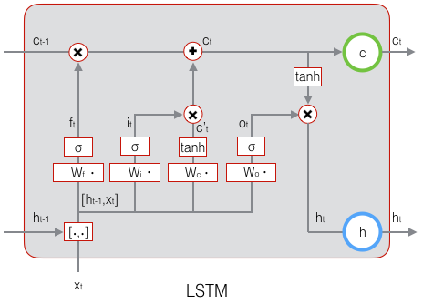

其中，$f_t$称为遗忘门，输出值大小在0~1之间，0表示完全忘记，1表示完全保持记忆；$i_t$称为输入门，决定当前网络有多少保存到状态c；$o_t$称为输出门，由输入、状态h和状态c决定；$c'_t$为当前输入状态c，$c_t$为当前状态c。

LSTM反向传播的推导公式更加复杂，一个是沿时间的反向传播，即从当前 t 时刻开始，计算每个时刻的误差项；一个是将误差项向上一层传播。共需更新8组参数：

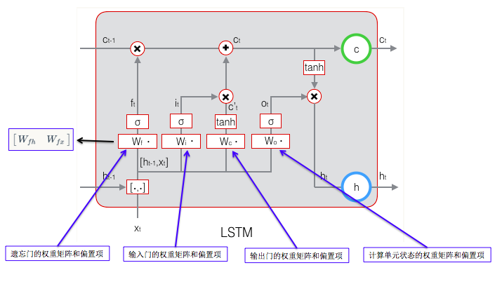

误差项沿时间的反向传递：

将误差项传递到上一层：

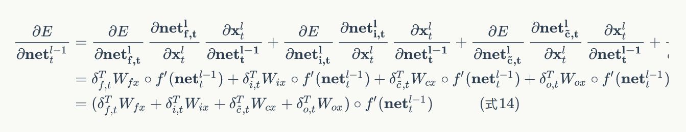

得到误差项，很容易求梯度，权重梯度：

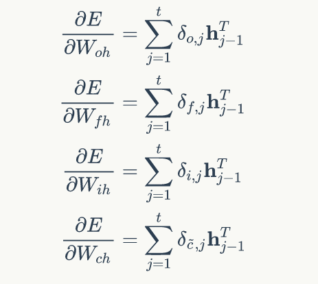

其余梯度同理可求

#### 定性理解避免梯度消失的原因
如下图，可以联想到resnet的跨越连接，梯度可以直接通过状态c的路线直接传到更远的时间点。

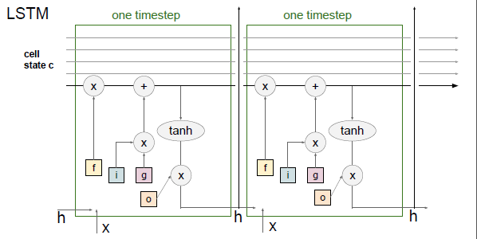

### GRU
LSTM存在很多变体，许多论文中的LSTM都或多或少的不太一样。在众多的LSTM变体中，GRU (Gated Recurrent Unit)也许是最成功的一种。

GRU对LSTM做了两个大改动：

1. 将输入门、遗忘门、输出门变为两个门：更新门（Update Gate）和重置门（Reset Gate）。
2. 将单元状态与输出合并为一个状态：h。

下图是GRU的示意图：

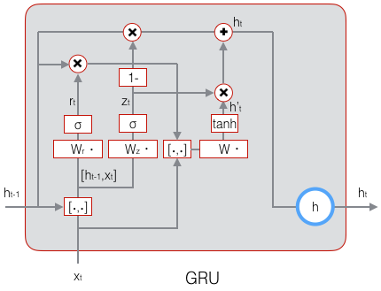

### 翻译系统
翻译系统相当于由encode与decode两部分组成，encode RNN将源语言信息存储到“记忆”中，decode RNN从“记忆”中解码输出另一种语言。每次迭代，输入到隐藏层的不仅仅是当前时刻的输入$x_t$,上一时刻的状态$h_{t-1}$，还有encode RNN输出的那个记忆$y_{t-1}$，还会引入注意力模型。

推荐阅读文章：[RNN反向传播公式推导](https://www.zybuluo.com/hanbingtao/note/541458)、 [字符级RNN实例详解](http://www.cnblogs.com/hellcat/p/7159527.html)