> 查看公式请安装插件[GitHub with MathJax](https://chrome.google.com/webstore/detail/github-with-mathjax/ioemnmodlmafdkllaclgeombjnmnbima)

<!-- TOC -->

- [分割](#分割)
    - [语义分割](#语义分割)
        - [前端](#前端)
        - [后端](#后端)
    - [实例分割](#实例分割)
- [注意力机制](#注意力机制)
    - [固定长度内部表征的局限性](#固定长度内部表征的局限性)
    - [注意力机制](#注意力机制-1)
    - [软注意力与硬注意力](#软注意力与硬注意力)
    - [任意区域注意力](#任意区域注意力)

<!-- /TOC -->
### 分割
#### 语义分割
给定一张图片,对图片中的每一个像素点进行分类，不区分相同种类的实例，属于经典计算机视觉问题。

通用框架：前端为FCN，后端为随机场（CRF、MRF）,即深度学习+概率图模型（PGM）

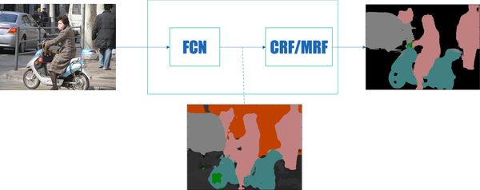

##### 前端
传统做法：提取小块图片通过CNN，为每个中心像素分类，反复此类做法

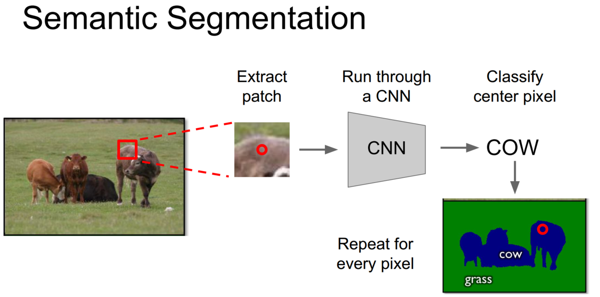

Multi-Scale：使用多尺度图像或者更多信息，并利用传统方法（超像素和分割树）获得图像的自然轮廓

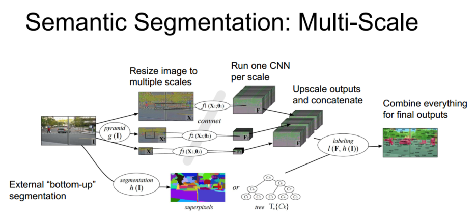

Refinement：在模型能力有限的情况下，多次迭代使得模型考虑到更大的感受野，不断优化之前的决策

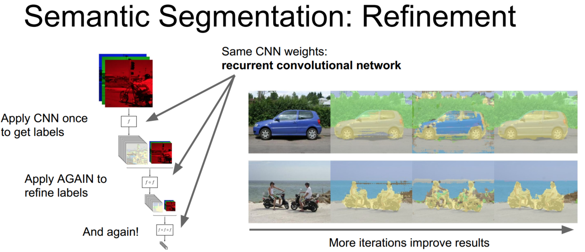

Upsampling：将高层特征转化原图大小的分割图，需要使用上采样，方式包括传统插值、参数可学习的deconvolution、上池化、带孔卷积等

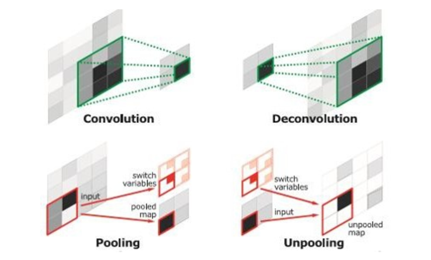

Skip Layer：将全卷积之后的特征直接上采样得到的结果是很粗糙的，故将不同池化层的特征进行上采样之后来优化输出。

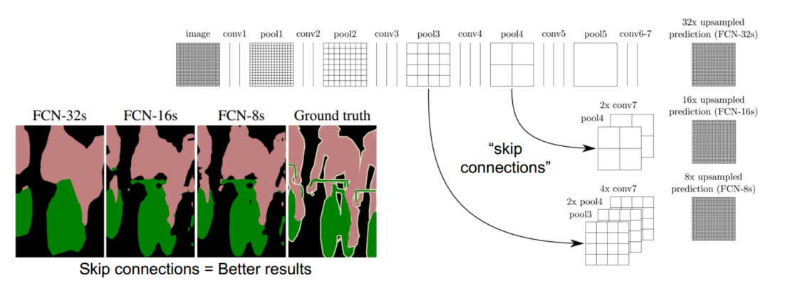

##### 后端
全连接条件随机场(DenseCRF)：
对于每个像素i具有类别标签$x_i$还有对应的观测值$y_i$，这样每个像素点作为节点，像素与像素间的关系作为边，即构成了一个条件随机场。CRFasRNN采用平均场近似的方法，多次迭代优化结果。

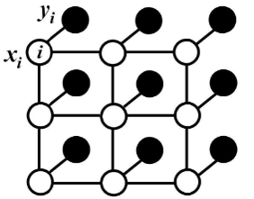

马尔科夫随机场(MRF)：
优点是将平均场构造成了CNN；联合训练并且可以one-pass inference，而不用迭代

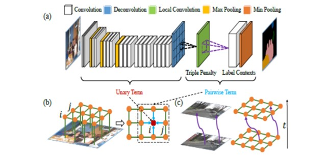

高斯条件随机场(G-CRF)：
优点是二次能量有明确全局；解线性简便很多

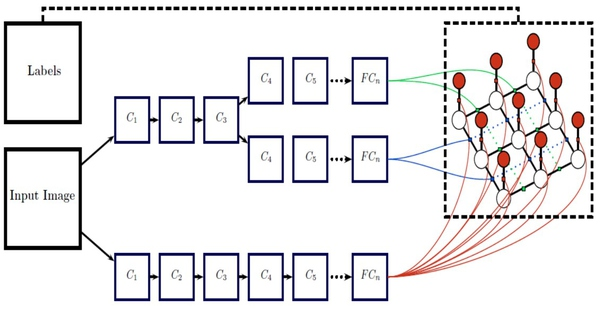

#### 实例分割
给定一张图片，判断目标各个实例，并标记实例像素，相当于同时进行检测和分割，属于近年计算机视觉问题。

类似RCNN的步骤：提取候选区域，一边利用两个CNN对候选区域分类，一边对候选区域掩码进行优化，主要方式为Hypercolumns，即利用多层特征。

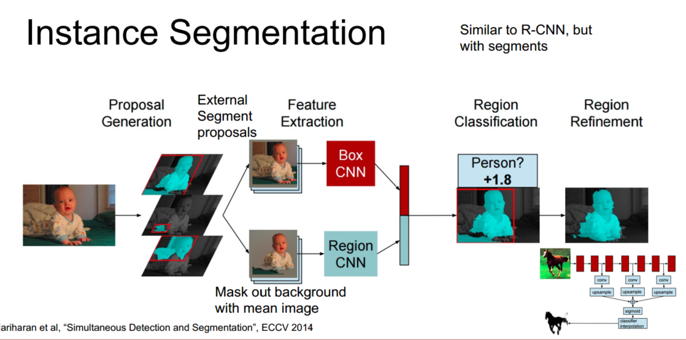

Multi-task Network Cascades：利用RPN提取候选区域，训练掩码再训练分类

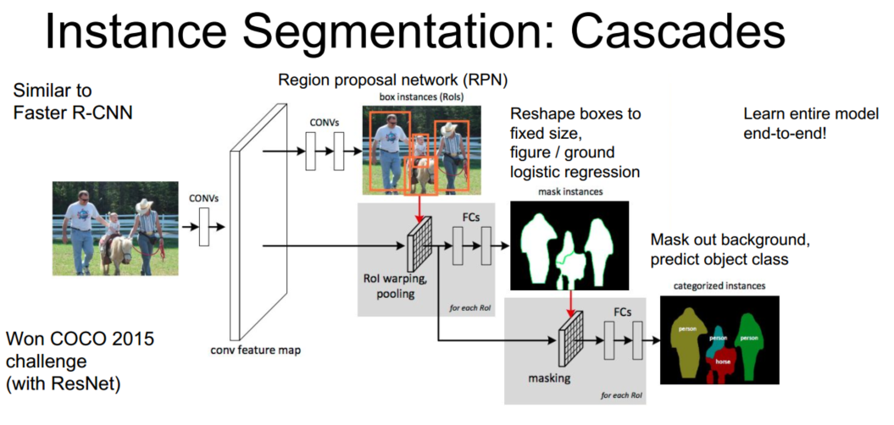

### 注意力机制

#### 固定长度内部表征的局限性
在编码器-解码器循环神经网络中，一系列长短期记忆网络（LSTM）学习将输入序列编码为固定长度的内部表征，另一部分长短期记忆网络读取内部表征并将它解码到输出序列中。然而，所有的输入序列都被强制编码成固定长度的内部向量，限制了这些网络的性能，尤其是考虑到比较长的输入序列时，例如文本翻译中的长句子。在图像领域，问题表现为只读取一次整张图片即输出结果，许多细节被忽视。

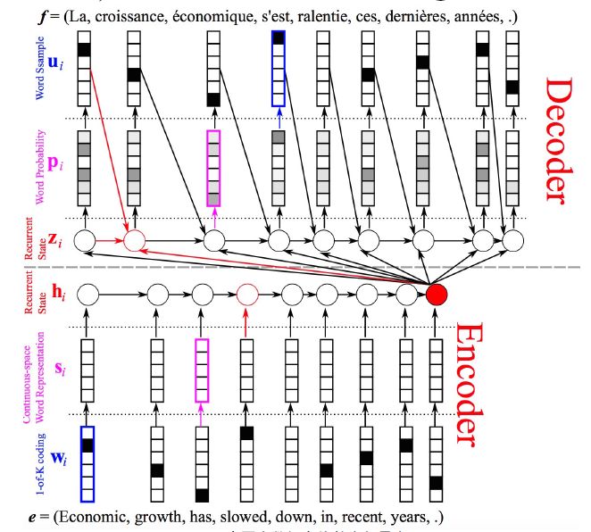

#### 注意力机制
训练模型学习如何选择性地关注输入，每时刻关注某显著部分而产生相应的词语，最后联系起来成合理的序列。这也符合人体视觉系统，不是直接将整个图像压缩成静态表示，根据显著的特征动态输出单词，再组成合理的序列，尤其是当图像内容很混乱时。

上图的步骤是：
1. 输入一张图片，进入了卷积神经网络CNNN做前向运算，得到L * D的feature向量，其中L为特征图大小（相当于将特征图分为 L 部分），D为特征图数量。
2. 先人为创建一个D * 1维的权重向量 W，乘以feature向量，得到一个 L 维的向量，将其输入RNN运算，得到注意力分布$a_1$，$a_1$大小与特征图大小相同，表示下一步选择哪一个特征区域的概率。
3. $a_1$与feature向量相乘求和得到$z_1$，即对 D 维特征图各部分都乘以一组概率，概率大的相当于放更多的注意力上去，概率小的相当于注意力减小，$z_1$是特征图显著部分的动态表示。
4. 下一个时刻，状态h1的输入包括$z_1$、$y_1$、$h_0$，同样输出$y_2$和注意力分布$a_2$，循环直到结束。

#### 软注意力与硬注意力

注意力公式如下：e为i时刻得到的注意力分布

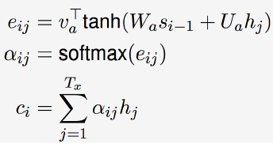

软注意力与硬注意力的区别：

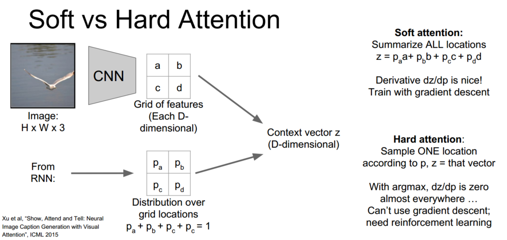

#### 任意区域注意力
一般的注意力模型只能将注意力局限在固定的划分格子，为更强大的网络能力，希望注意力能涉及任意区域。

Spatial Transformer Networks：通过预测仿射矩阵参数得到任意区域注意力，仿射变换

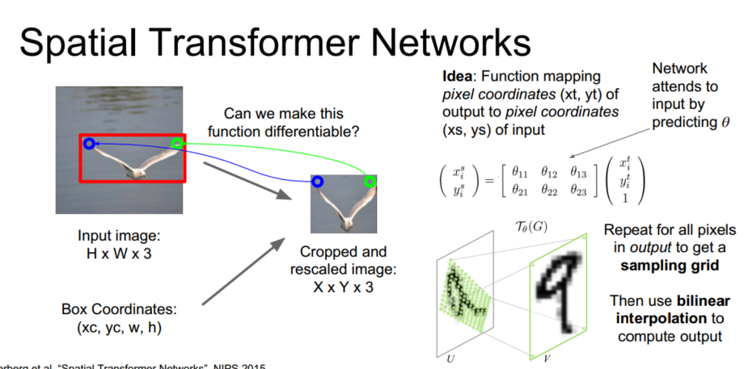

先预测参数$\theta$，计算出原始图的采样网格，利用双线性插值得到输出。

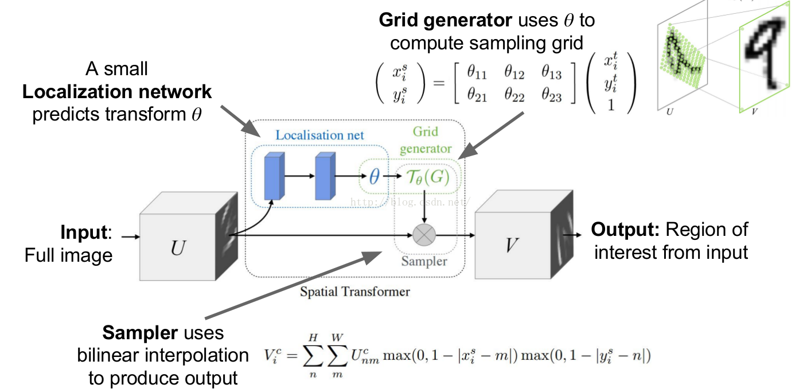

得到结果：

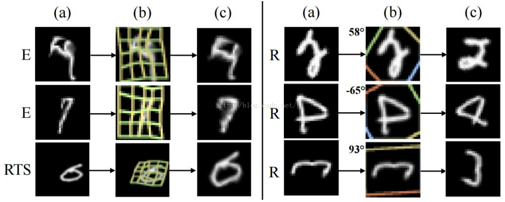

推荐阅读文章[图像语义分割之FCN和CRF](https://zhuanlan.zhihu.com/p/22308032)、[多篇用DL做Semantic Segmentation的文章总结](http://blog.csdn.net/u011148330/article/details/49446443)
