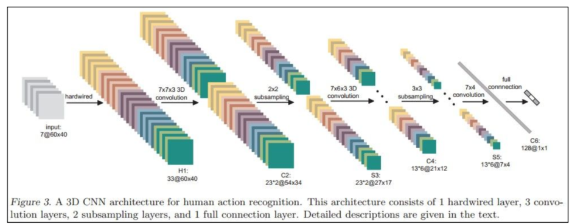
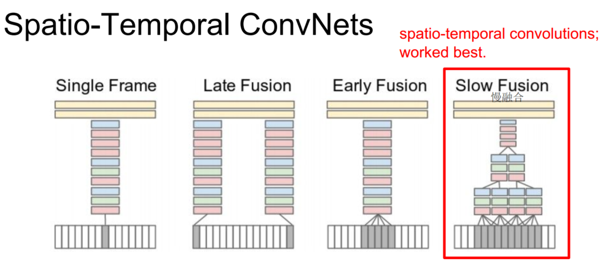
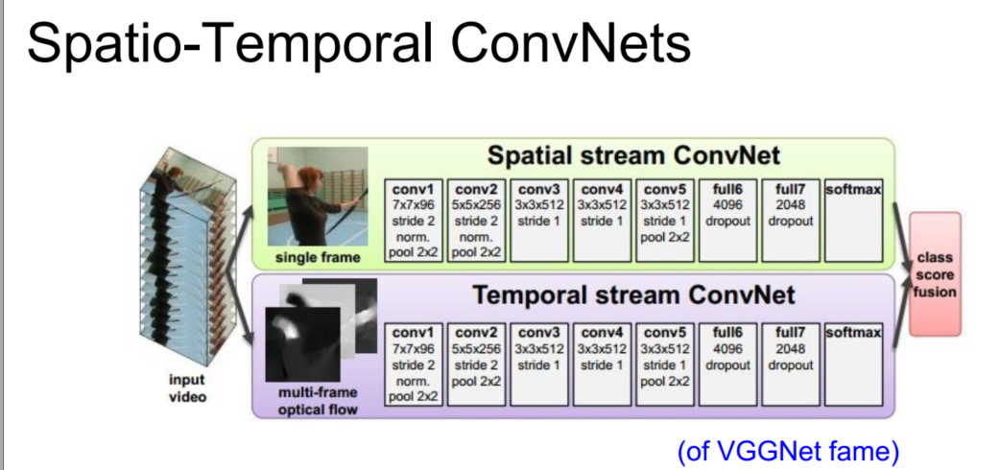
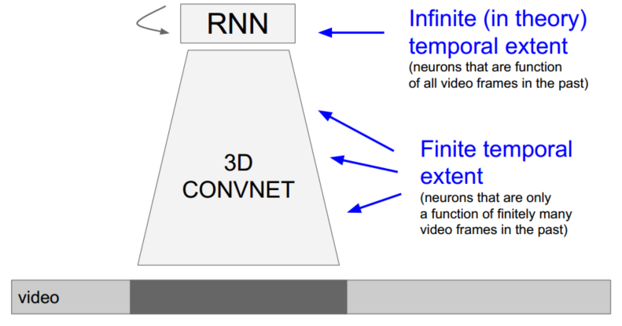
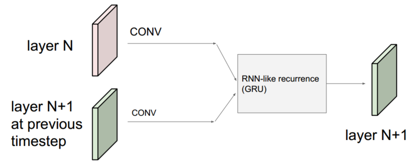
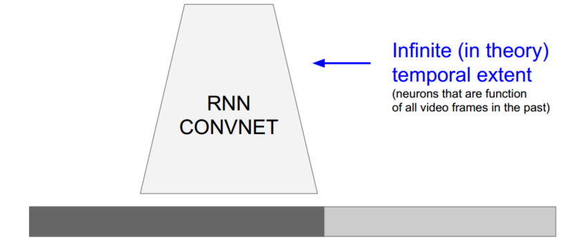
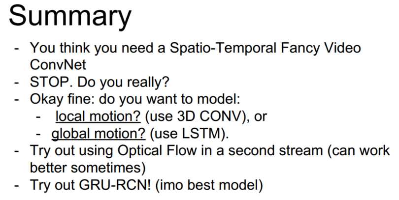

> 查看公式请安装插件[GitHub with MathJax](https://chrome.google.com/webstore/detail/github-with-mathjax/ioemnmodlmafdkllaclgeombjnmnbima)
<!-- TOC -->

- [视频应用](#视频应用)
- [基于特征](#基于特征)
- [时空CNN](#时空cnn)
- [长期时空CNN](#长期时空cnn)
- [总结](#总结)

<!-- /TOC -->
#### 视频应用
CNN在图像任务比如ImageNet上取得很好的效果，但是在视频相关的任务中还没有太大的进展，简单介绍一些卷积神经网络的知识以及其在视频动作分类中的应用。
#### 基于特征
使用光流法跟踪关键点，在局部坐标系对轨迹提取HOG/HOF/MBH等特征，进而识别视频动作。

#### 时空CNN
Spatio-Temporal ConvNets结合空域和时域的信息，输入一小段视频，而卷积核增多至原来的T倍，T为视频的帧数，相当于3D卷积。

为获取不同时域的信息，视频的提取方式不同

- single frame：就是把一帧帧的图像分别输入到CNN中去，和普通的处理图像的CNN没有区别。
- late fusion：把相聚L的两帧图像分别输入到两个CNN中去，然后在最后一层连接到同一个full connect的softmax层上去。
- early fusion：把连续L帧的图像叠在一起输入到一个CNN中去。
- slow fusion：和上边的CNN的区别在于一个卷积核的输出不是一个二维的图像，而是一个三维的图像。

另一种同时利用时域和空域信息的CNN：单帧图片和多帧光流图，能获得更好的效果

#### 长期时空CNN
当视频中两个的关联动作相隔时间过长，无法一起输入时空CNN提取相关信息，可以使用LSTM/RNN存储长期信息。

一般情况网络结果如下所示：

为平衡和优化整个网络，将RNN融合到CNN，具体是卷积核的输入包括前一层网络和上一个时间网络，RNN结构包括Vanilla RNN、LSTM、GRU等，一般选择GRU。

得到结果：

#### 总结

附：推荐阅读文章[视频行为识别年度进展](https://zhuanlan.zhihu.com/p/27415472)