### 简介
在实践过程不断摸索，总结出较好的执行策略，强化学习的本质就是解决“decision making”问题，即学会自动进行决策。在computer science领域体现为机器学习算法。在Engineering领域体现在决定the sequence of actions来得到最好的结果。在Neuroscience领域体现在理解人类大脑如何做出决策，主要的研究是reward system。在Psychology领域，研究动物如何做出决策，动物的行为是由什么导致的。在Economics领域体现在博弈论的研究。这所有的问题最终都归结为一个问题，人为什么能够并且如何做出最优决策。

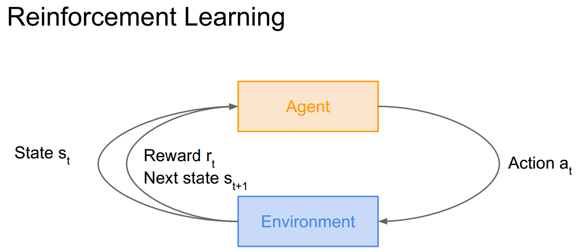

### 马尔可夫决策过程
在数学上可将强化学习描述成马尔科夫决策过程，具体如下

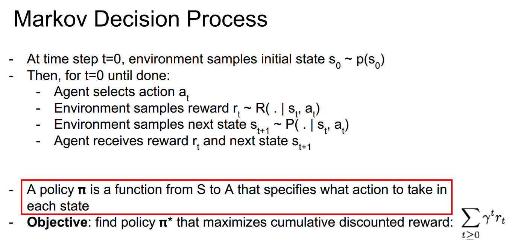

其中定义(S,A,R,P,γ)
- S：所有可能状态的集合
- A：所有可能动作的集合
- R：对于给定的状态和动作，对应奖赏的分布
- P：转移概率，受选择的动作或者外部因素的影响，当前状态按某种概率转移到另一个状态
- γ：折扣因子，折扣使得到达目的地的路途越远则回报越小

目标是找到决策π最大化累积奖赏值

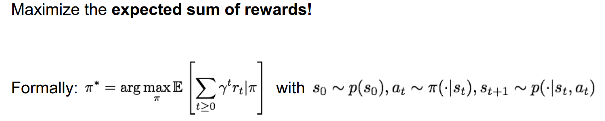

在优化目标之前定义两个评估函数：Value function 和 Q-value function（最优值函数和最优状态-动作值函数）,目标即优化评估函数

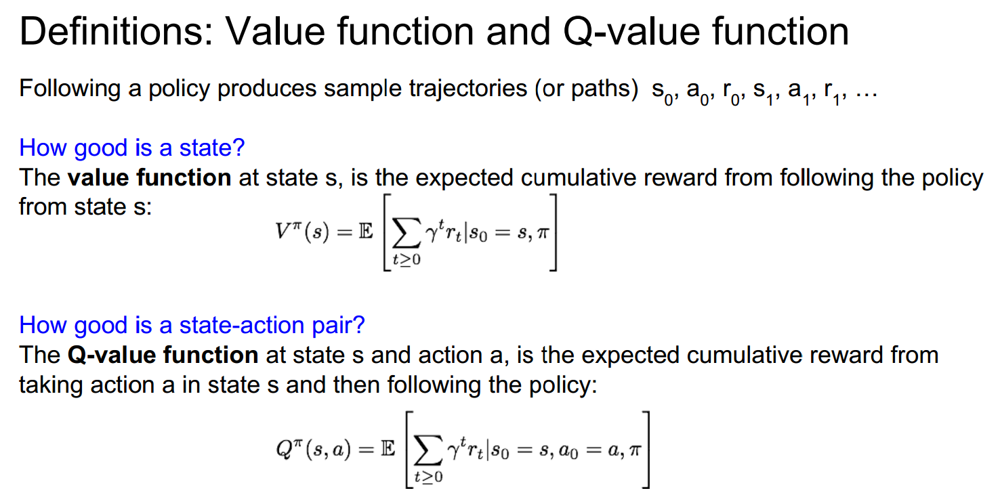

Q-value函数的优化符合Bellman等式，有点类似动态规划，当前的最优策略为前一步最优策略+当前最大化选择

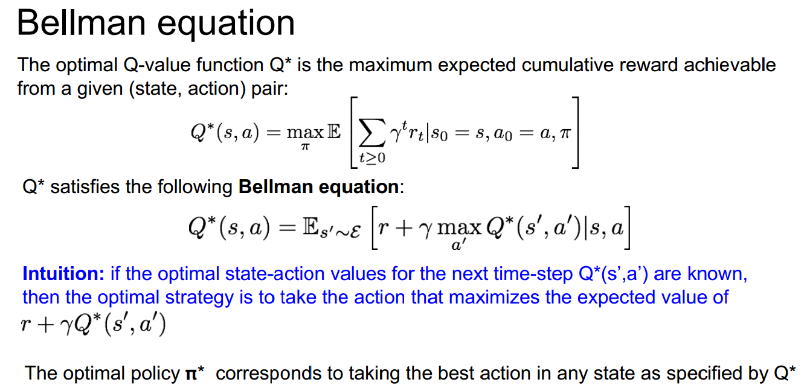

利用Bellman等式进行迭代式更新（时序差分学习），得到如下算法Q-learning：

### DQN
之前假设Q(s,a)是关于有限状态的“表格值函数”，但是现实中值函数对应的状态空间往往是连续的，有无穷多个状态。直接的方法是对状态空间进行离散化，将连续状态空间转化为有限状态空间，但如何有效离散化仍是个难题，不妨直接对连续状态空间的值函数进行学习，推荐的方法是深度神经网络，则学习算法称为DQN。

使用神经网络Q(θ)估计Q，并利用前向传播和反向传播更新参数

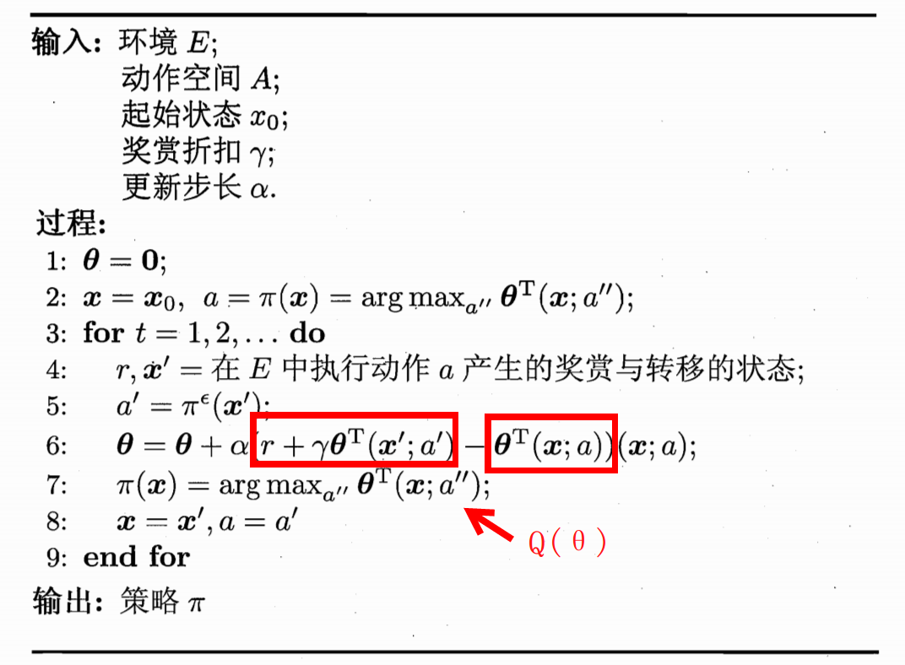

以玩Atari游戏为目标，DQN网络结构如下：

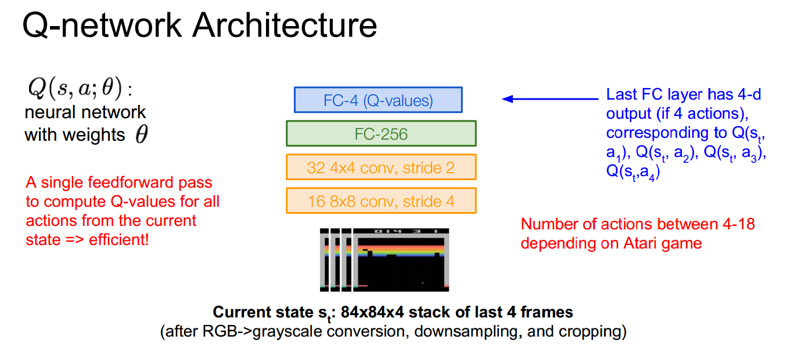

在训练网络的过程中，为避免数据关联和坏循环，通常选择使用反复闯关的技巧来训练网络。

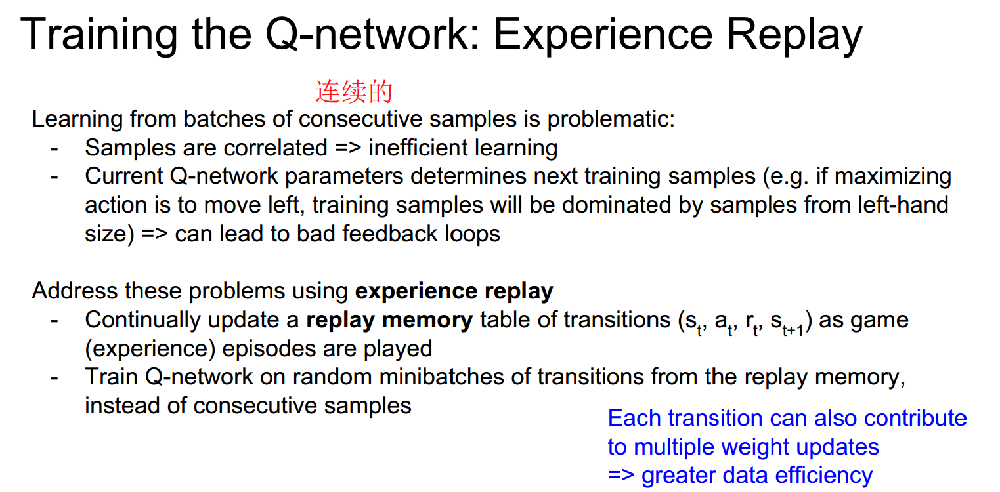

具体算法如下：

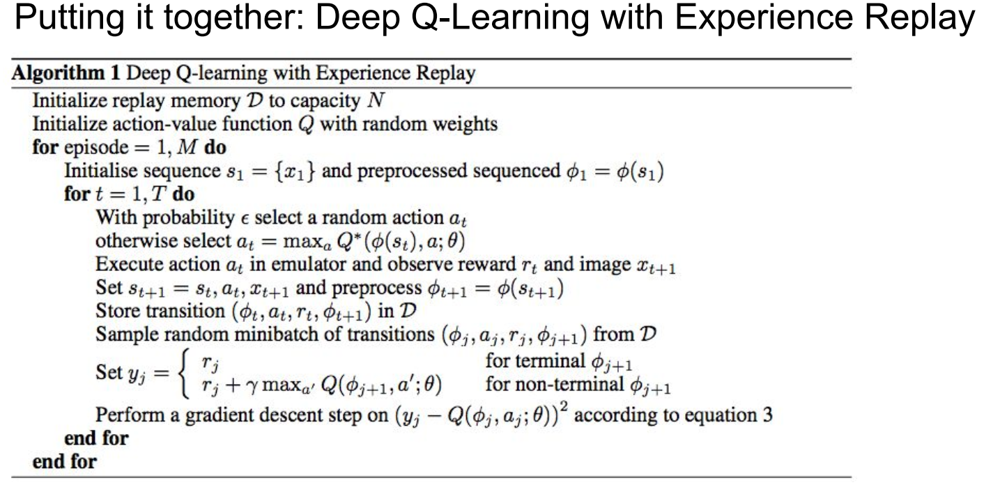

### Policy Gradients
对于Q-learning算法，Q-function模型也许过于复杂，比如机器人抓物体可能有非常高维的状态导致无法学习准确的Q值。不如跳过预测Q值，直接从所有策略中学习出最优的策略。以下是推导过程，得到策略梯度：

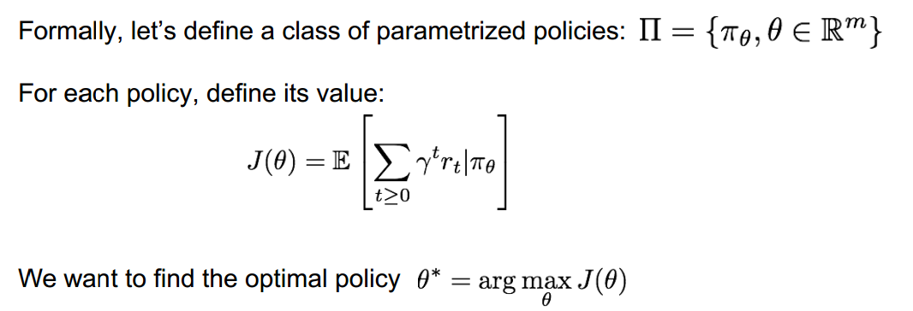

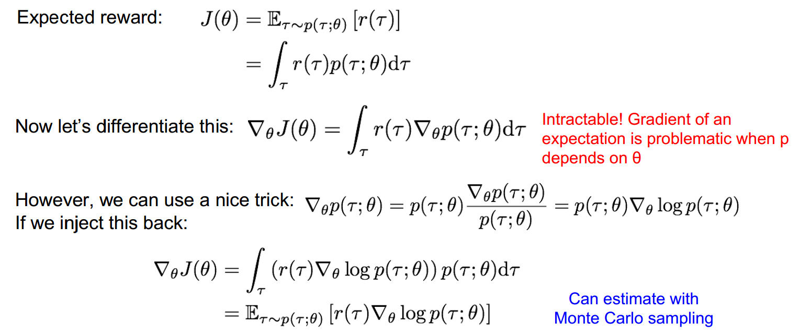

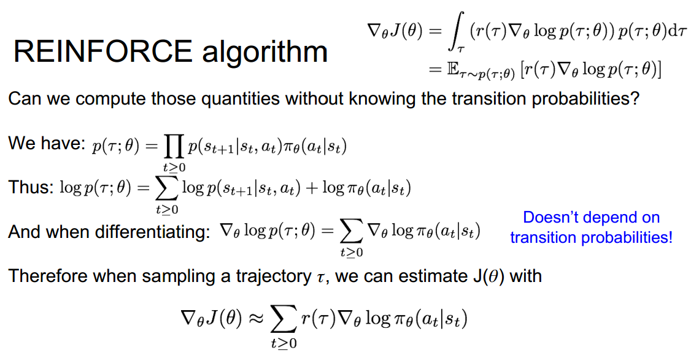

对于策略梯度的估计式子，可见当r(τ)较大时将使当前动作的概率升高，当r(τ)较小时将使当前动作的概率降低。但对于采集的轨道τ，奖励函数方差较大会使得梯度不稳定。有以下减小方差的做法：

1、将未来的所有奖励叠加

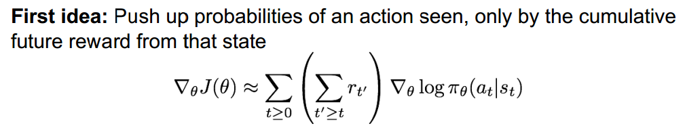
2、延迟的影响加上折扣

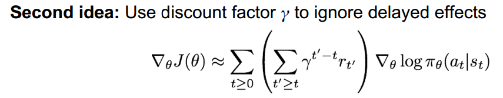
3、引入基准函数，一般是奖励的移动平均值

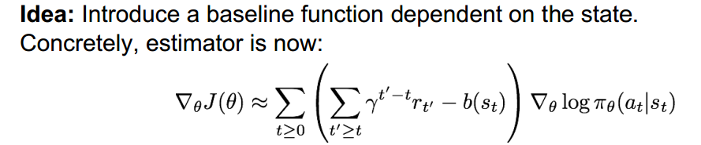

进一步，为更好地衡量r(τ)，改为使用Value function和Q-value function的差值，若Q值使用深度学习预测，则算法变为Actor-Critic算法

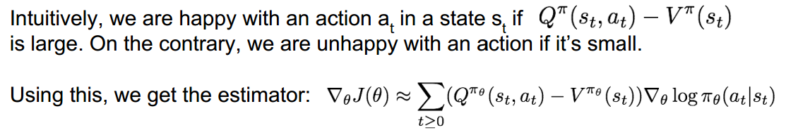

Actor-Critic算法结合Policy Gradients和Q-learning，使用actor和critic两个网络，表演者即策略，评论家即Q值。算法如下所示：

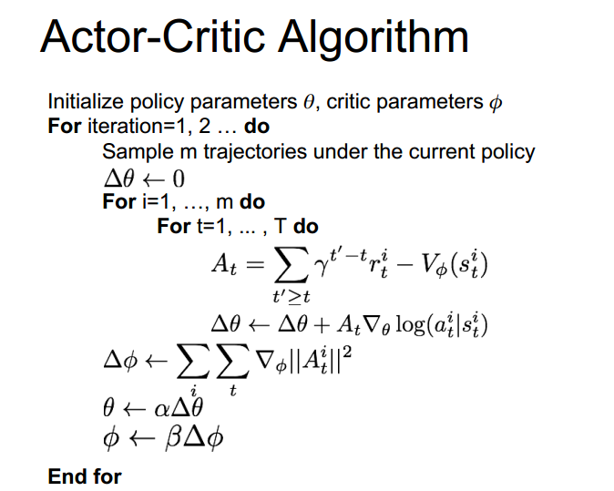
### 总结

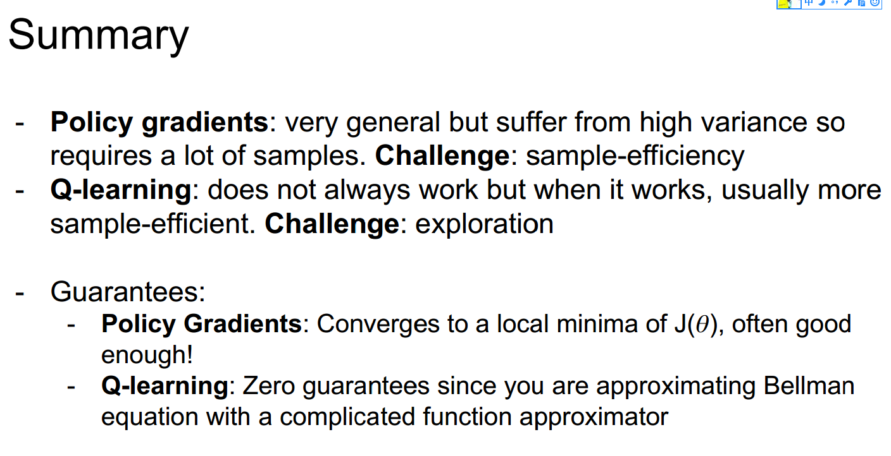