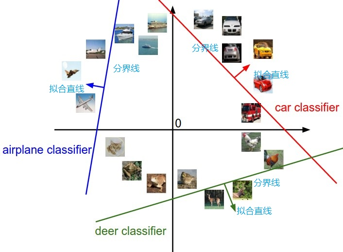
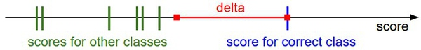
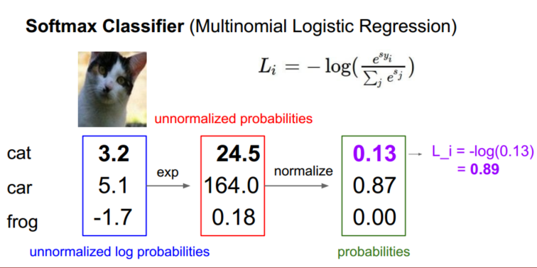
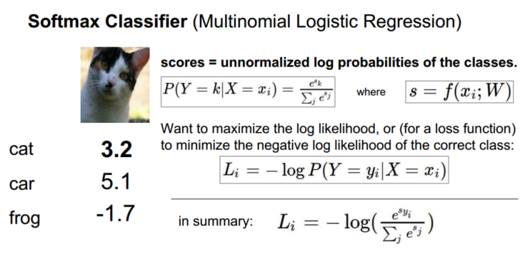
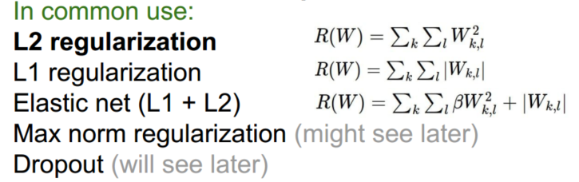

> 查看公式请安装插件[GitHub with MathJax](https://chrome.google.com/webstore/detail/github-with-mathjax/ioemnmodlmafdkllaclgeombjnmnbima)

- [线性分类器](#线性分类器)
- [SVM损失函数（折叶损失）](#svm损失函数（折叶损失）)
- [Softmax分类器](#softmax分类器)
### 线性分类器
简介：针对图像分类，线性分类器比KNN分类器更加强大，并可以自然地延伸到神经网络和卷积神经网络上。这种方法主要有两部分组成：一个是评分函数（score function），它是原始图像数据到类别分值的映射。另一个是损失函数（loss function），它是用来量化预测分类标签的得分与真实标签之间一致性的。

评分函数：$f(x_i,W,b)=Wx_i+b$，即将原始图像像素线性映射到分类分值，参数W被称为权重（weights），b被称为偏差向量（bias vector）

理解：
* 将图像看做高维度的点，线性分类器描述对应的梯度分界线

* 将线性分类器看做模板匹配，权重W的每一行对应着一个分类的模板

损失函数：使用损失函数（Loss Function）（有时也叫代价函数Cost Function或目标函数Objective）来衡量我们对结果的不满意程度。直观地讲，当评分函数输出结果与真实结果之间差异越大，损失函数输出越大，反之越小。损失函数的具体形式多种多样。

### SVM的损失函数（折叶损失）
想要分类器在正确分类上的得分始终比不正确分类上的得分高出一个边界值$\Delta$（$\Delta$为超参数）。
方程如下：
$$L_i=\sum_{j \neq y_i}max(0,s_j-s_{y_i}+\Delta)$$

计算过程：

直观理解：

如果其他分类分数进入了红色的区域，甚至更高，那么就开始计算损失。如果没有这些情况，损失值为0。
### Softmax的损失函数（交叉熵损失）
在Softmax分类器中，函数映射$f(x_i;W)=Wx_i$保持不变，但将这些评分值视为每个分类的未归一化的对数概率，并且将折叶损失（hinge loss）替换为交叉熵损失（cross-entropy loss）
方程如下：
$$ Li=-log(\frac{e^{f_{y_i}}}{\sum_j e^{f_j}}) $$

计算例子：

理解：

信息论视角：
最小化在估计分类概率分布（就是上面的$e^{f_{y_i}}/\sum_je^{f_j}$）和"真实"概率（$p=[0,...1,...,0]$中在$y_i$的位置就有一个单独的1）分布之间的交叉熵

概率论视角：
最小化正确分类的负对数概率，这可以看做是在进行最大似然估计（MLE）,而损失函数中的正则化部分R(W)可以被看做是权重矩阵W的高斯先验，进行的是最大后验估计（MAP）而不是最大似然估计。

### 正则化

假设有一个数据集和一个权重集W能够正确地分类每个数据（即所有的边界都满足，对于所有的i都有$L_i=0$）,可能有很多相似的W都能正确地分类所有的数据。为了消除模糊性，并取得更好的权重W，向损失函数添加一个正则化惩罚（regularization penalty）$R(W)$部分。
因此，损失函数由两部分组成：数据损失（data loss），即所有样例的的平均损失$L_i$，以及正则化损失（regularization loss）。完整公式如下所示，左边为数据损失，右边为正则化损失（$\lambda$为超参数）：
$$L= \frac{1}{N}\sum_i L_i+\lambda R(W)$$

$R(W)$的选择：

正则化有时能引入优秀的性质，比如$L_2正则化$倾向于更小更分散的权重向量，这就会鼓励分类器最终将所有维度上的特征都用起来。

### 优化
