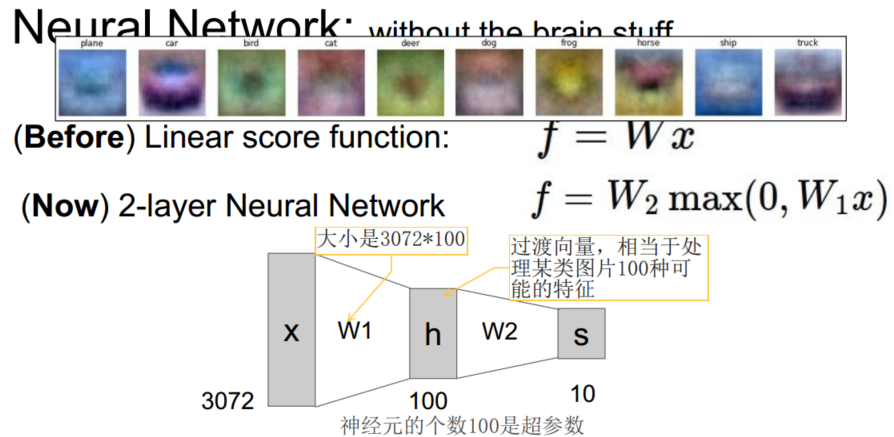
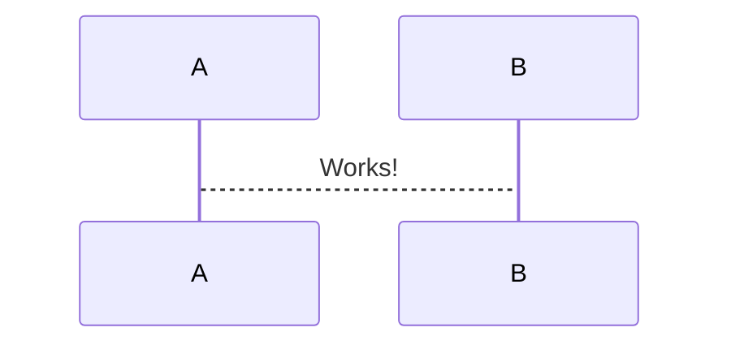

> 查看公式请安装插件[GitHub with MathJax](https://chrome.google.com/webstore/detail/github-with-mathjax/ioemnmodlmafdkllaclgeombjnmnbima)

### 快速简介
对比线性分类器（BTW，傅立叶变换是线性积分变换，时域映射到频域），神经网络引入非线性的激活函数以及更多层线性函数，形成线性与非线性的交织，最后映射到标签（可推测GAN跟傅立叶一样牛）。参数$W_1$,$W_2$同样通过随机梯度下降来更新，它们的梯度在反向传播中利用链式法则来求导计算得出。



### 单个神经元建模
神经元的计算模型：沿着轴突传来的信号（比如$x_0$）将基于突触的突触强度（比如$w_0$），与其他神经元的树突进行乘法交互（比如$w_0x_0$），信号在细胞体中相加。如果最终之和高于某个阈值，那么神经元将会_激活_，向其轴突输出一个峰值信号。

```flow
st=>start: Start:>http://www.google.com[blank]
e=>end:>http://www.google.com
op1=>operation: My Operation
sub1=>subroutine: My Subroutine
cond=>condition: Yes
or No?:>http://www.google.com
io=>inputoutput: catch something...
st->op1->cond
cond(yes)->io->e
cond(no)->sub1(right)->op1
```



### 神经网络结构

