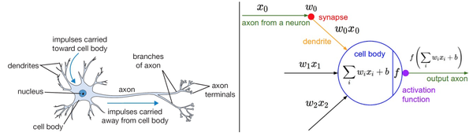
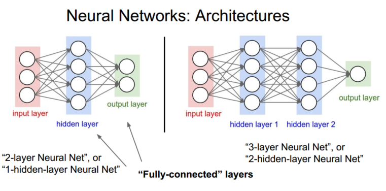
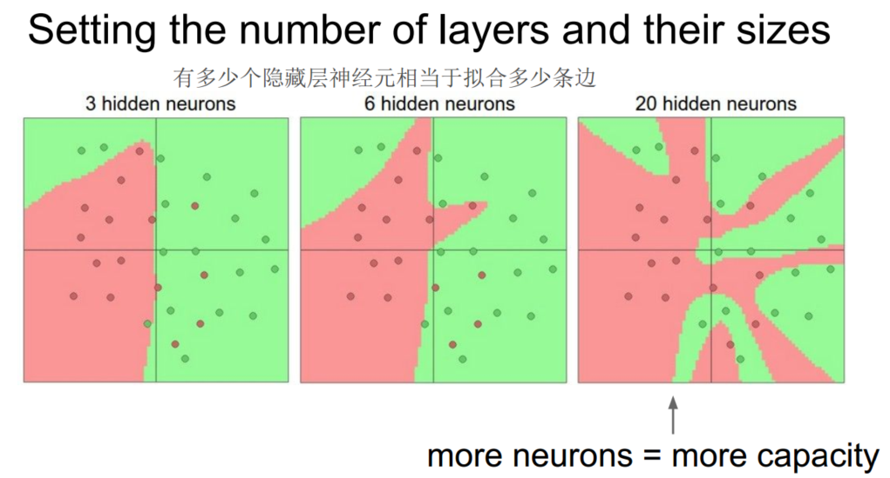
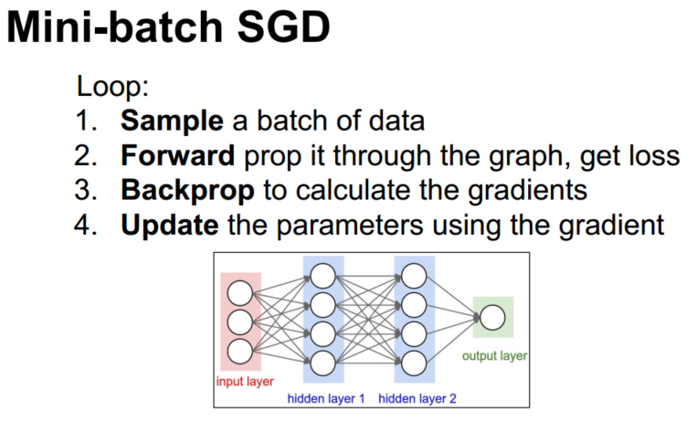

> 查看公式请安装插件[GitHub with MathJax](https://chrome.google.com/webstore/detail/github-with-mathjax/ioemnmodlmafdkllaclgeombjnmnbima)
<!-- TOC -->

- [快速简介](#快速简介)
- [单个神经元建模](#单个神经元建模)
- [神经网络结构](#神经网络结构)
- [探索网络层的数量和尺寸](#探索网络层的数量和尺寸)
- [训练神经网络](#训练神经网络)

<!-- /TOC -->
### 快速简介
对比线性分类器（BTW，傅立叶变换是线性积分变换，时域映射到频域），神经网络引入非线性的激活函数以及更多层线性函数，形成线性与非线性的交织，最后映射到标签（可推测GAN跟傅立叶一样牛）。参数$W_1$,$W_2$同样通过随机梯度下降来更新，它们的梯度在反向传播中利用链式法则来求导计算得出。


目前要有意识：像素距离分类(kNN)->高纬度线性分类->强大的非线性分类
### 单个神经元建模
神经元的计算模型如图所示：



要注意这个对于生物神经元的建模是非常粗糙的，在实际中，有很多不同类型的神经元，每种都有不同的属性。

理解：神经元模型的前向计算数学公式相似，只要在神经元的输出端有一个合适的损失函数，就能让单个神经元变成一个线性分类器。加上交叉熵损失则为Softmax分类器，加上折叶损失则为SVM分类器。正则化损失从生物学角度可以看做逐渐遗忘，因为它的效果是让所有突触权重w在参数更新过程中逐渐向着0变化。

### 神经网络结构
神经网络被建模成神经元的集合，神经元之间以无环图的分层形式进行连接，方便向量化操作。度量神经网络的尺寸标准：一个是神经元的个数，另一个是参数的个数。



前向传播：不断重复的矩阵乘法与激活函数交织，代码套路如下：
```python
    # 一个3层神经网络的前向传播:
    f = lambda x: 1.0/(1.0 + np.exp(-x)) # 激活函数(用的sigmoid)
    x = np.random.randn(3, 1) # 含3个数字的随机输入向量(3x1)
    h1 = f(np.dot(W1, x) + b1) # 计算第一个隐层的激活数据(4x1)
    h2 = f(np.dot(W2, h1) + b2) # 计算第二个隐层的激活数据(4x1)
    out = np.dot(W3, h2) + b3 # 神经元输出(1x1)
```

表达能力：神经网络是一个通用函数近似器，但是该性质与其广泛使用无太大关系。之所以使用神经网络，是因为它们对于实际问题中的函数的公式能够某种程度上做出"正确"假设。

### 探索网络层的数量和尺寸
有更多神经元的神经网络可以表达更复杂的函数，优势是可以分类更复杂的数据，不足是可能造成对训练数据的过拟合。



防止神经网络的过拟合有很多方法（L2正则化，dropout和输入噪音等），使用这些方法来控制过拟合比减少网络神经元数目要好得多。主要原因在于小网络更难使用梯度下降等局部方法来进行训练：虽然小型网络的损失函数的局部极小值更少，也比较容易收敛到这些局部极小值，但是这些最小值一般都很差，损失值很高。相反，大网络拥有更多的局部极小值，但就实际损失值来看，这些局部极小值表现更好，损失更小。

### 训练神经网络
与训练线性分类器相似，通过随机梯度下降来更新，利用链式法则在反向传播中求导计算出梯度，更新参数使得损失方程最小。


