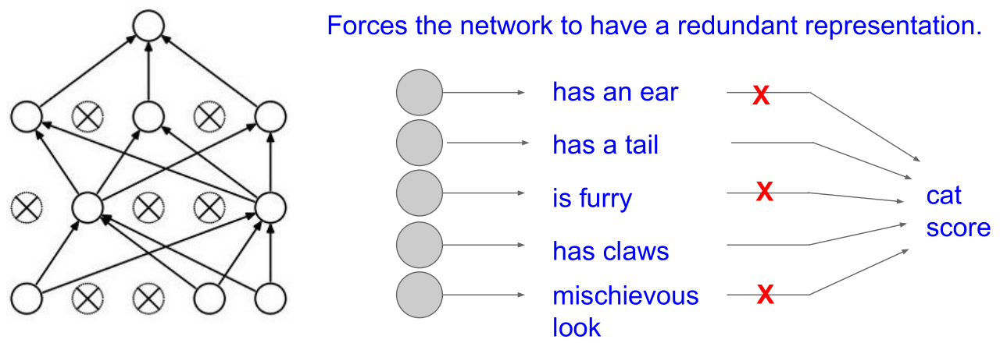

> 查看公式请安装插件[GitHub with MathJax](https://chrome.google.com/webstore/detail/github-with-mathjax/ioemnmodlmafdkllaclgeombjnmnbima)
<!-- TOC -->

- [激活函数](#激活函数)
- [数据预处理](#数据预处理)
- [参数初始化](#参数初始化)
    - [小随机数初始化](#小随机数初始化)
    - [使用$1/\sqrt{n}$校准方差](#使用1\sqrtn校准方差)
    - [稀疏初始化（Sparse initialization）](#稀疏初始化sparse-initialization)
    - [偏置（biases）的初始化](#偏置biases的初始化)
    - [批量标准化BN](#批量标准化bn)
- [损失函数](#损失函数)
    - [正则化](#正则化)
        - [L1正则化](#l1正则化)
        - [L2正则化](#l2正则化)
        - [最大范式约束（Max norm constraints）](#最大范式约束max-norm-constraints)
        - [偏置正则化](#偏置正则化)
        - [随机失活（dropout）](#随机失活dropout)
    - [数据损失](#数据损失)
        - [分类问题](#分类问题)
        - [属性分类](#属性分类)
        - [回归问题](#回归问题)
        - [结构化预测](#结构化预测)

<!-- /TOC -->
### 激活函数

Sigmoid：$\sigma(x)=1/(1+e^{-x})$

Tanh：

ReLU（校正线性单元）：

LReLU和PReLU：

Maxout：$max(w^T_1x+b_1,w^T_2x+b_2)$

建议：用ReLU非线性函数。注意设置好学习率，监控网络中死亡的神经元占的比例。如果单元死亡问题困扰你，就试试Leaky ReLU或者Maxout。

### 数据预处理
零中心化：它对数据中每个独立特征减去平均值，从几何上可以理解为在每个维度上都将数据云的中心都迁移到原点。而对于图像，更常用的是减去对应图像的均值而不是每个维度的均值，也可以在3个颜色通道上分别操作。理解：初始化时参数为0均值，线性分类器经过原点，能更快速地分类零中心的数据。

归一化（即标准化）：数据在每一维度的数值范围都近似相等，通常有两种方式。第一种是先对数据做零中心化处理，然后每个维度都除以其标准差，相当于对每个维度上的数据做标准化。第二种方法是对每个维度都做归一化，使得每个维度的最大和最小值是1和-1。在图像处理中像素的数值范围几乎是一致的，归一化不是很必要。

PCA：过线性变换将原始数据变换为一组各维度线性无关的表示，可用于提取数据的主要特征分量，常用于高维数据的降维, 通常使用PCA降维过的数据训练线性分类器和神经网络会达到非常好的性能效果，同时还能节省时间和存储器空间。

白化：白化操作的输入是特征基准上的数据，然后对每个维度除以其特征值来对数值范围进行归一化。该变换的几何解释是：如果数据服从多变量的高斯分布，那么经过白化后，数据的分布将会是一个均值为零，且协方差相等的矩阵。

注意：任何预处理策略（比如数据均值）都只能在训练集数据上进行计算，算法训练完毕后再应用到验证集或者测试集上。在实际操作中，只会做零中心化处理。

### 参数初始化
不能将所有参数设为0, 因为如果网络中的每个神经元都计算出同样的输出，然后它们就会在反向传播中计算出同样的梯度，从而进行同样的参数更新，神经元之间就失去了不对称性的源头；从代价函数的角度来说, 参数初始化又不能太大，因此权重初始值要非常接近0又不能等于0。

#### 小随机数初始化

过小的数值使得传播的数据分布在0处，那么在反向传播的时候就会计算出非常小的梯度, 出现梯度消失问题；过大的数值使得传播的数据分布在饱和区，同样出现梯度消失问题。

#### 使用$1/\sqrt{n}$校准方差

随着输入数据量的增长, 随机初始化的神经元的输出数据的分布中的方差也在增大。可以推算出：$Var(s)=(nVar(w))Var(x)$，根据$Var(aX)=a^2Var(X)$, 只要在权重前面乘上系数$a=1/\sqrt{n}$就可以。而对于ReLU神经元，一半的数据分布被消减导致方差减半，应改为乘上系数$1/\sqrt{2.0/n}$。

#### 稀疏初始化（Sparse initialization）

将所有权重矩阵设为0，但是为了打破对称性，每个神经元都同下一层固定数目的神经元随机连接，其权重数值由一个小的高斯分布生成。

#### 偏置（biases）的初始化

通常将偏置初始化为0，这是因为随机小数值权重矩阵已经打破了对称性。对于ReLU非线性激活函数，用0.01这样的小数值常量作为所有偏置的初始值能让所有的ReLU单元一开始就激活，就能保存并传播一些梯度, 但是这样做是不是总是能提高算法性能并不清楚。

推荐是使用ReLU激活函数，并且使用`w = np.random.randn(n) * np.sqrt(2.0/n)`(Xavier init)来进行权重初始化

#### 批量标准化BN
在网络的每一层之前都做预处理, 使得数据服从标准正态分布，将全连接层或卷积层与激活函数之间添加一个BatchNorm层, 使用了批量归一化的网络对于不好的初始值有更强的鲁棒性

由于BN操作也就是标准化是一个简单可求导的操作, 所以对于整个网络依然可以利用梯度下降法进行迭代优化。

### 损失函数
损失函数=数据损失+正则损失

#### 正则化
通过控制神经网络的容量来防止其过拟合
##### L1正则化
向目标函数增加一个$\lambda|w|$
性质：权重向量在最优化的过程中变得稀疏（即非常接近0），也就是说，使用L1正则化的神经元最后使用的是它们最重要的输入数据的稀疏子集。

##### L2正则化
向目标函数增加一个$\frac{1}{2}\lambda w^2$，加上$\frac{1}{2}$使得关于w梯度就是$\lambda w$而不是$2\lambda w$，所有的权重都以$w += -\lambda * W$向着0线性下降。
性质：对于大数值的权重向量进行严厉惩罚，倾向于更加分散的权重向量, 这样就可以使得网络更倾向于使用所有输入特征, 而不是严重依赖输入特征中某些小部分特征。

相较L1正则化，L2正则化中的权重向量大多是分散的小数字, 如果不是特别关注某些明确的特征选择，一般说来L2正则化都会比L1正则化效果好, L1和L2正则化也可以进行组合：$\lambda_1|w|+\lambda_2w^2$。

##### 最大范式约束（Max norm constraints）
给每个神经元中权重向量的量级设定上限，并使用投影梯度下降来确保这一约束，在实践中$\overrightarrow{w}$必须满足$||\overrightarrow{w}||_2<c$，一般c值为3或者4。

##### 偏置正则化
对于偏置参数的正则化并不常见，因为它们在矩阵乘法中和输入数据并不产生反向梯度(常数项求导为0)，使用了合理数据预处理的情况下，对偏置进行正则化也很少会导致算法性能变差, 这可能是因为相较于权重参数，偏置参数实在太少

##### 随机失活（dropout）
在训练时让神经元以超参数p的概率被激活或者被设置为0，在predict函数中不进行随机失活，但是对于两个隐层的输出都要乘以p，调整其数值范围。

* 在训练过程中，随机失活可以被认为是对完整的神经网络抽样出一些子集，每次基于输入数据只更新子网络的参数, 但是数量巨大的子网络们并不是相互独立的，因为它们都共享参数
* 在训练过程中做多次的Dropout训练, 每次采用不同的Dropout mask, 相当于每次产生了一个子网络模型, 在测试过程中不使用随机失活，可以理解为是对数量巨大的子网络们做了模型集成（model ensemble）, 以此来计算出一个平均的预测。

Dropout的另一种解释：

引申：既然测试性能如此关键，实际更倾向使用反向随机失活（inverteddropout），它是在训练时就进行数值范围调整，从而让前向传播在测试时保持不变。

实践：通过交叉验证获得一个全局使用的l2正则化强度，同时在所有层后面使用随机失活也很常见，p值一般默认设为0.5，也可能在验证集上调参。

#### 数据损失
数据损失是一个有监督学习问题，用于衡量分类算法的预测结果（即分类评分）和真实标签结果之间的一致性。公式为：$L=\frac{1}{N}\sum_iL_i$中，N是训练集数据的样本数，相当于对所有样本的数据损失求平均。

##### 分类问题
每个样本数据具有唯一的真实标签

SVM分类器的折叶损失：
$$L_i=\sum_{j neq y_i}max(0,f_j-f_{y_i}+1)$$

有些学者的论文中指出平方折叶损失效果更好

Softmax分类器的交叉熵损失：
$$L_i=-log(\frac{e^{f_{y_j}}}{\sum_j e^{f_j}})$$

当类别的数目非常庞大的时候, 就需要使用 Hierarchical Softmax , Hierarchical Softmax将标签分解成一个树, 每个标签都表示成这个树上的一个路径，这个树的每个节点处都训练一个Softmax分类器来决策左树还是右树, 树的结构对于算法的最终结果影响很大，而且一般需要具体问题具体分析

##### 属性分类
当$y_i$是一个二值向量，每个样本具有一个或多个属性，而且属性之间并不相互排斥。

1、对每个属性创建一个独立的二分类的分类器,
$$L_i=\sum_j max(0,1−y_{ij}f_j)$$

在上式中,
* y_{ij}表示第j个类别的第i个属性的真实值, y_{ij}的值为1或者-1
* 当该类别被正确预测并展示的时候，分值向量fjfj为正，其余情况为负
* 当一个正样本的得分小于+1，或者一个负样本得分大于-1的时候就会累计损失值

2、对每种属性训练一个独立的逻辑回归分类器

$$L_i=\sum_j y_{ij}log(\sigma(f_j))+(1−y_{ij})log(1-\sigma(f_j))$$

##### 回归问题
通常是计算预测值和真实值之间的损失, 然后用L2平方范式或L1范式度量差异。如果有多个数量被预测了，要对预测的所有维度的预测求和。

$$L_i=||f-y_i||^2_2$$
$$L_i=||f-y_i||_1=\sum_j|f_j-(y_i)_j|$$

注意：L2损失要比Softmax损失优化起来困难很多, 因为L2要预测一个真实的确切值, 而Softmax是一种概率意义上的预测, 还有一点就是L2对于异常值来说会导致很大的局部梯度, 所以在回归问题中, 我们依然优先考虑可否转化为分类问题去解决, 比如如果对一个产品的星级进行预测，使用5个独立的分类器来对1-5星进行打分的效果一般比使用一个回归损失要好很多。分类还有一个额外优点，就是能给出关于回归的输出的分布，而不是一个简单的毫无把握的输出值。如果确信分类不适用，那么使用L2损失吧，但是一定要谨慎。

##### 结构化预测
结构化损失是指标签可以是任意的结构，例如图表、树或者其他复杂物体的情况。通常这种情况还会假设结构空间非常巨大，不容易进行遍历。结构化SVM背后的基本思想就是在正确的结构$y_i$和得分最高的非正确结构之间画出一个边界。解决这类问题，并不是像解决一个简单无限制的最优化问题那样使用梯度下降就可以了，而是需要设计一些特殊的解决方案，这样可以有效利用对于结构空间的特殊简化假设。
