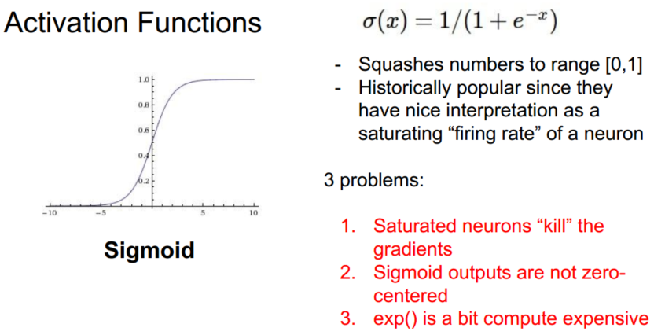
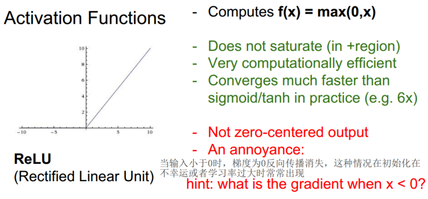
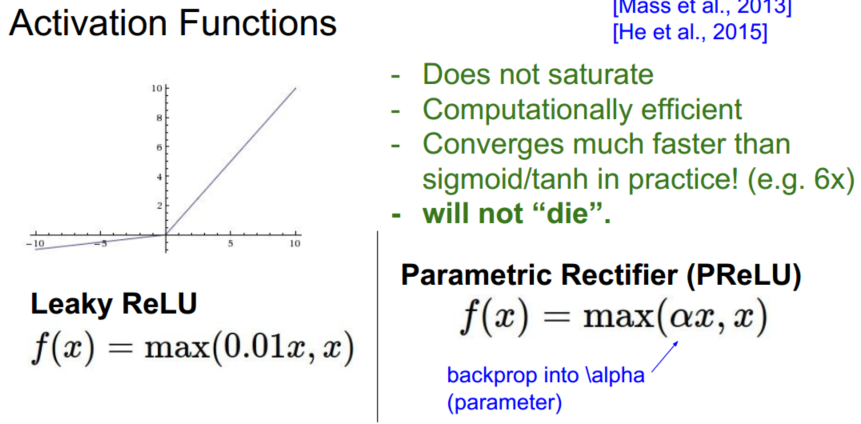
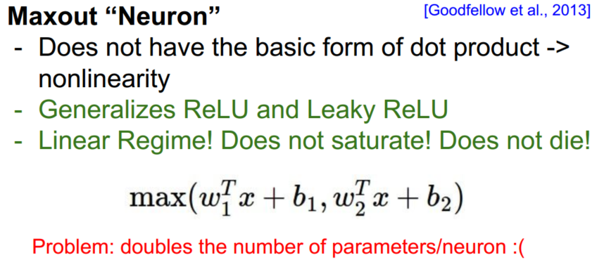
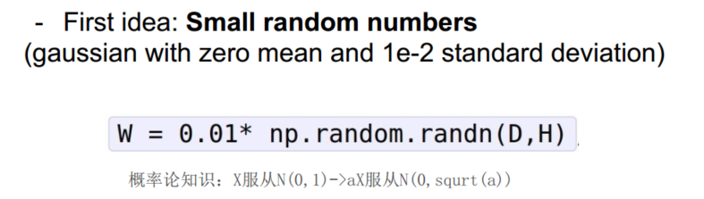
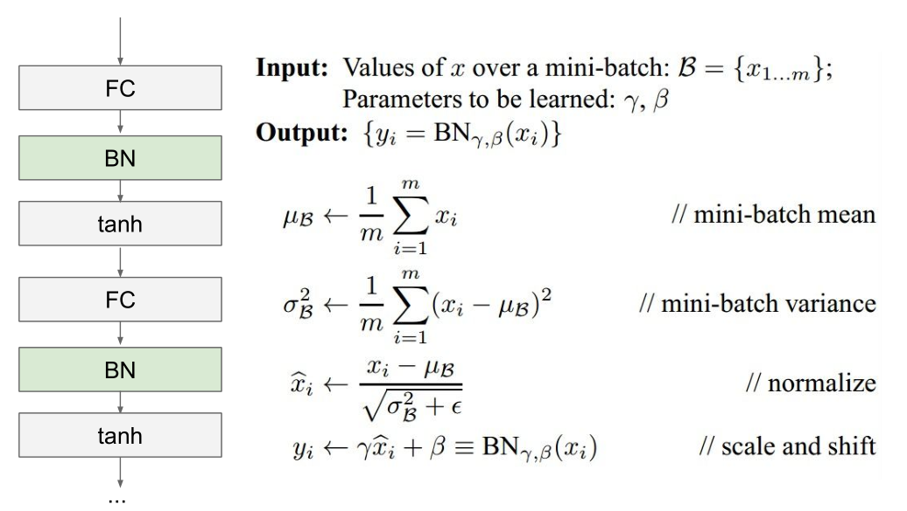

> 查看公式请安装插件[GitHub with MathJax](https://chrome.google.com/webstore/detail/github-with-mathjax/ioemnmodlmafdkllaclgeombjnmnbima)

### 激活函数

Sigmoid：$\sigma(x)=1/(1+e^{-x})$

Tanh：

ReLU（校正线性单元）：

LReLU和PReLU：

Maxout：$max(w^T_1x+b_1,w^T_2x+b_2)$

建议：用ReLU非线性函数。注意设置好学习率，监控网络中死亡的神经元占的比例。如果单元死亡问题困扰你，就试试Leaky ReLU或者Maxout。

### 数据预处理
零中心化：它对数据中每个独立特征减去平均值，从几何上可以理解为在每个维度上都将数据云的中心都迁移到原点。而对于图像，更常用的是减去对应图像的均值而不是每个维度的均值，也可以在3个颜色通道上分别操作。理解：初始化时参数为0均值，线性分类器经过原点，能更快速地分类零中心的数据。

归一化（即标准化）：数据在每一维度的数值范围都近似相等，通常有两种方式。第一种是先对数据做零中心化处理，然后每个维度都除以其标准差，相当于对每个维度上的数据做标准化。第二种方法是对每个维度都做归一化，使得每个维度的最大和最小值是1和-1。在图像处理中像素的数值范围几乎是一致的，归一化不是很必要。

PCA：过线性变换将原始数据变换为一组各维度线性无关的表示，可用于提取数据的主要特征分量，常用于高维数据的降维, 通常使用PCA降维过的数据训练线性分类器和神经网络会达到非常好的性能效果，同时还能节省时间和存储器空间。

白化：白化操作的输入是特征基准上的数据，然后对每个维度除以其特征值来对数值范围进行归一化。该变换的几何解释是：如果数据服从多变量的高斯分布，那么经过白化后，数据的分布将会是一个均值为零，且协方差相等的矩阵。

注意：任何预处理策略（比如数据均值）都只能在训练集数据上进行计算，算法训练完毕后再应用到验证集或者测试集上。在实际操作中，只会做零中心化处理。

### 参数初始化
不能将所有参数设为0, 因为如果网络中的每个神经元都计算出同样的输出，然后它们就会在反向传播中计算出同样的梯度，从而进行同样的参数更新，神经元之间就失去了不对称性的源头；从代价函数的角度来说, 参数初始化又不能太大，因此权重初始值要非常接近0又不能等于0。

小随机数初始化

过小的数值使得传播的数据分布在0处，那么在反向传播的时候就会计算出非常小的梯度, 出现梯度消失问题；过大的数值使得传播的数据分布在饱和区，同样出现梯度消失问题。

使用$1/\sqrt{n}$校准方差

随着输入数据量的增长, 随机初始化的神经元的输出数据的分布中的方差也在增大。可以推算出：$Var(s)=(nVar(w))Var(x)$，根据$Var(aX)=a^2Var(X)$, 只要在权重前面乘上系数$a=1/\sqrt{n}$就可以。而对于ReLU神经元，一半的数据分布被消减导致方差减半，应改为乘上系数$1/\sqrt{2.0/n}$。

稀疏初始化（Sparse initialization）

将所有权重矩阵设为0，但是为了打破对称性，每个神经元都同下一层固定数目的神经元随机连接，其权重数值由一个小的高斯分布生成。

偏置（biases）的初始化

通常将偏置初始化为0，这是因为随机小数值权重矩阵已经打破了对称性。对于ReLU非线性激活函数，用0.01这样的小数值常量作为所有偏置的初始值能让所有的ReLU单元一开始就激活，就能保存并传播一些梯度, 但是这样做是不是总是能提高算法性能并不清楚。

推荐是使用ReLU激活函数，并且使用`w = np.random.randn(n) * np.sqrt(2.0/n)`来进行权重初始化

批量标准化BN
在网络的每一层之前都做预处理, 使得数据服从标准正态分布，将全连接层或卷积层与激活函数之间添加一个BatchNorm层, 使用了批量归一化的网络对于不好的初始值有更强的鲁棒性

由于BN操作也就是标准化是一个简单可求导的操作, 所以对于整个网络依然可以利用梯度下降法进行迭代优化。

### 正则化

### 梯度检查
