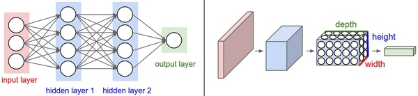
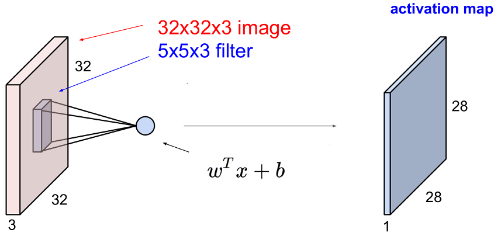
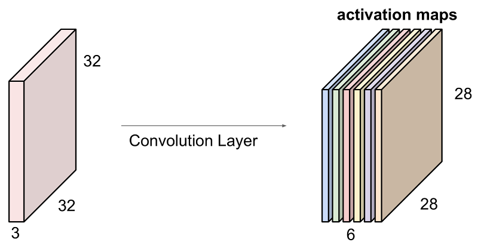
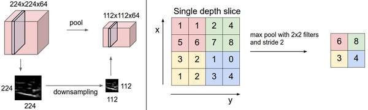
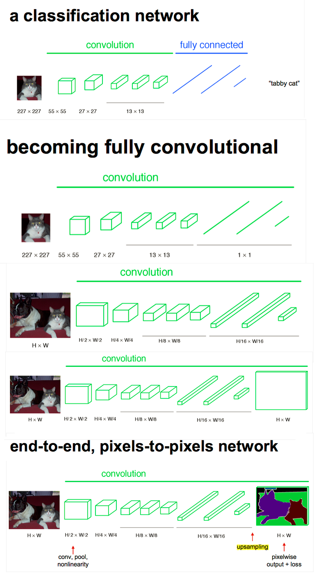

> 查看公式请安装插件[GitHub with MathJax](https://chrome.google.com/webstore/detail/github-with-mathjax/ioemnmodlmafdkllaclgeombjnmnbima)

<!-- TOC -->

- [结构概述](#结构概述)
- [构建卷积神经网络的各种层](#构建卷积神经网络的各种层)
    - [卷积层](#卷积层)
    - [池化层](#池化层)
    - [全连接层](#全连接层)
- [卷积神经网络的结构](#卷积神经网络的结构)
    - [层的排列规律](#层的排列规律)
    - [尺寸设置规律](#尺寸设置规律)
- [案例学习](#案例学习)

<!-- /TOC -->
### 结构概述
NN的结构是一系列的层将输入数据变换为输出数据。常规NN隐藏层都为全连接层，构建大网络时效率低下，容易过拟合。而CNN调整结构为卷积层、池化层、全连接层，大趋势是逐渐去掉全连接层，各层中的神经元是3维排列的：宽度、高度和深度。

例子：输入层-卷积层-ReLU层-汇聚层-全连接层（醒醒，层是由神经元组成而不是权重，并且应当在神经元的角度往前一层观察）

* 输入层：原始像素值所形成3维数组[32x32x3]，图像宽高均为32，有3个颜色通道。
* 卷积层：神经元通过卷积核与输入层中的一个局部区域相连，卷积核大小为3*3*3，一般情况将深度忽略而称为3*3，padding之后输出数据体的维度就是[32x32x12]。
* ReLU层：逐个元素地进行激活函数操作，该层对数据尺寸没有改变。
* 池化层：在空间维度（宽度和高度）上进行降采样操作，数据尺寸变为[16x16x12]。
* 全连接层：神经元与前一层中所有神经元相连接，神经元数量设为标签数量，数据尺寸变为[1x1x10]。

每个层的输入是3D数据，使用一个可导的激活函数将其变换为3D的输出数据；有的层有参数比如卷积层和全连接层，有的没有比如ReLU层和池化层；有的层有额外的超参数比如卷积层、全连接层和池化层，有的没有比如ReLU层。

### 构建卷积神经网络的各种层
#### 卷积层
卷积层是构建卷积神经网络的核心层，它产生了网络中大部分的计算量。

卷积核：卷积层的参数是有一些可学习的小卷积核集合构成的，卷积核尺寸为$kernel size\times kernel size\times num$（num是前一层的深度），前向传播时每个滤波器都与输入数据在宽高深三个维度做离散卷积运算。

特征图：又称为激活图，一个卷积核与输入数据卷积会生成一个二维激活图，每个卷积层上有多个卷积核也就有多个激活图，将激活图在深度方向上层叠起来就生成了输出数据。

局部连接：每个神经元只与输入数据的一个局部区域连接，该连接的空间大小叫做神经元的感受野（receptive field）。它的尺寸是一个超参数（即滤波器的空间尺寸），连接在空间（宽高）上是局部的，但是在深度上总是和输入数据的深度一致。

也就是说, 神经元的参数向量的中参数的个数只和卷积核大小k*k(等价于感受野的大小)和输入数据的维数n有关, w中的参数个数为[k*k*n]

空间排列：3个超参数控制着输出数据体的尺寸，分别为深度、步长、零填充（常用来保持输入数据体在空间上的尺寸）。输出数据体在空间上的尺寸可以通过输入数据体尺寸（W），卷积层中神经元的感受野尺寸（F），步长（S）和零填充的数量（P）的函数来计算：(W-F+2P)/S+1

参数共享：一个特征图由一个卷积核计算得出，即同一个激活图应该共享同一组权重和偏置，可以显著地减少参数数量。在反向传播的时候，都要计算每个神经元对它的权重的梯度，但是需要把同一个特征图上的所有神经元对权重的梯度累加，这样就得到了对共享权重的梯度。这样，每个特征图只更新一个权重集。

参数共享的合理性：因为图像结构具有平移不变性，如果一个特征在计算某个空间位置(x,y)的时候有用，那么它在计算另一个不同位置(x',y')的时候也有用，没有必要重新学习去探测一个特征。有时候参数共享假设可能并不适用，特别是当卷积神经网络的输入图像是一些明确的中心结构时候, 这时候我们就应该期望在图片的不同位置学习到完全不同的特征, 比如输入图像是人脸，人脸一般都处于图片中心, 你可能期望学习到不同的特征(比如眼睛特征或者头发特征), 这些特征也许在图片的不同位置, 这时就应该打破参数共享的限制, 在同一个深度切片中使用局部参数不一致的卷积核, 这时将该层称为局部连接层（Locally-Connected Layer）

卷积层参数：
* 输入数据体的尺寸为$W_1\times H_1\times D_1$
* 4个超参数：滤波器的数量K；滤波器的空间尺寸F；步长S；零填充数量P
* 输出数据体的尺寸为$W_2\times H_2\times D_2$，其中： 
 $$ W_2=(W_1-F+2P)/S+1 $$
 $$ H_2=(H_1-F+2P)/S+1 $$
 $$ D_2=K $$
* 由于参数共享，每个滤波器包含$F\cdot F\cdot D_1$个权重，卷积层一共有$F\cdot F\cdot D_1\cdot K$个权重和K个偏置。
* 在输出数据体中，第d个特征图（空间尺寸是$W_2\times H_2$），用第d个滤波器和输入数据进行有效卷积运算的结果（使用步长S），最后在加上第d个偏差。
* 对这些超参数，常见的设置是F=3，S=1，P=1。

拓展阅读：
* 反向传播：卷积操作的反向传播（同时对于数据和权重）还是一个卷积（但是是和空间上翻转的滤波器）
* 1$\times$1卷积：[Network in Network](https://arxiv.org/abs/1312.4400)，如果输入是[32x32x3]，那么1x1卷积就是在高效地进行3维点积（因为输入深度是3个通道）
* 扩张卷积：[Multi-Scale Context Aggregation by Dilated Convolutions](https://arxiv.org/abs/1511.07122)，在某些设置中，扩张卷积与正常卷积结合起来非常有用，因为在很少的层数内更快地汇集输入图片的大尺度特征

#### 池化层
在连续的卷积层之间会周期性地插入一个池化层(Pooling), 通过采样的方式逐渐降低数据体的空间尺寸，这样的话就能减少网络中参数的数量，使得计算资源耗费变少，也能有效控制过拟合。Pooling层通常采用Max操作，此外有平均汇聚（average pooling）和L-2范式汇聚（L2-norm pooling）。注意：对更大感受野进行汇聚需要的汇聚尺寸也更大，而且往往对网络有破坏性。

汇聚层的一些公式：
* 输入数据体尺寸$W_1\cdot H_1\cdot D_1$
* 有两个超参数：空间大小F，步长S
* 输出数据体尺寸$W_2\cdot H_2\cdot D_2$，其中
$$W_2=(W_1-F)/S+1$$
$$H_2=(H_1-F)/S+1$$
$$D_2=D_1$$

* 因为对输入进行的是固定函数计算，所以没有引入参数
* 在池化层中很少使用零填充

反向传播：回顾一下反向传播的内容，其中max(x,y)函数的反向传播可以简单理解为将梯度只沿最大的数回传。因此，在向前传播经过汇聚层的时候，通常会把池中最大元素的索引记录下来（有时这个也叫作道岔（switches）），这样在反向传播的时候梯度的路由就很高效。

#### 全连接层
在全连接层中，神经元对于前一层中的所有激活数据是全部连接的，与常规神经网络中一样。全连接层和卷积层可以相互转化，而全连接层转化为卷积层在实际运用中更加有用，推荐阅读[FCN](http://simtalk.cn/2016/11/01/Fully-Convolutional-Networks/)。

* 对于任一个卷积层，都存在一个能实现和它一样的前向传播函数的全连接层。权重矩阵是一个巨大的矩阵，除了某些特定块（这是因为有局部连接），其余部分都是零。而在其中大部分块中，元素都是相等的（因为参数共享）。
* 相反，任何全连接层都可以被转化为卷积层，最大的局部等于全局。比如，一个K=4096的全连接层，输入数据体的尺寸是$7\times 7\times 512$，这个全连接层可以被等效地看做一个F=7,P=0,S=1,K=4096的卷积层。换句话说，就是将滤波器的尺寸设置为和输入数据体的尺寸一致，这样输出就变成$1\times 1\times 4096$，本质上和全连接层的输出是一样的。
* 把全连接层的权重W重塑成卷积层的滤波器的优势，即FCN：除去全连接层，输入图片为什么可以是任意大小；让卷积网络在一张更大的输入图片上滑动就会得到得到多个输出，每个输出可以代表对每个区域的评分, 通过这样的转化可以让我们在向前传播的过程中一次性地把一张更大的图片的不同区域都分别带入到卷积网络，得到对于每个区域的得分再取平均，比将图片分割输入全连接更加方便（不是指计算量减小），常用于像素级别分割。

### 卷积神经网络的结构
卷积神经网络通常是由三种层构成：卷积层，汇聚层（除非特别说明，一般就是最大值汇聚）和全连接层（简称FC）
#### 层的排列规律
$$INPUT -> [[CONV -> RELU]\times N -> POOL?]\times M -> [FC -> RELU]\times K -> FC$$
POOL?指的是一个可选的汇聚层，通常0<=N<=3，M>=0，K>=0，通常K<3。
* 每个池化层前有两个卷积层，这个思路适用于更大更深的网络，因为在执行具有破坏性的汇聚操作前，多重的卷积层可以从输入数据中学习到更多的复杂特征
* 几个小滤波器卷积层的组合比一个大滤波器卷积层好。前者具有同等的感受野，又能表达出输入数据中更多个强力特征，使用的参数也更少。唯一的不足是，在进行反向传播时，中间的卷积层可能会导致占用更多的内存。
* 传统的将层按照线性进行排列的方法已经受到了挑战，挑战来自谷歌的Inception结构和微软亚洲研究院的残差网络（Residual Net）结构。

#### 尺寸设置规律
输入层：
应该能被2整除很多次。

卷积层：
应该使用小尺寸滤波器（比如3x3或最多5x5），使用步长S=1。对输入数据进行零填充，这样卷积层就不会改变输入数据在空间维度上的尺寸，还可以提高算法性能，避免边缘的信息过快地损失掉；步长为1可以让空间维度的降采样全部由汇聚层负责，卷积层只负责对输入数据体的深度进行变换

池化层：
最常用的设置是用用2x2感受野（即F=2）的最大值池化，步长为2（S=2），注意这一操作将会把输入数据中75%的激活数据丢弃（因为对宽度和高度都进行了2的降采样）。最大值汇聚的感受野尺寸很少有超过3的，因为汇聚操作过于激烈，易造成数据信息丢失过多

因为内存限制所做的妥协：在实践中，人们倾向于在网络的第一个卷积层做出妥协。例如，可以妥协可能是在第一个卷积层使用步长为2，尺寸为7x7的滤波器（比如在ZFnet中）。在AlexNet中，滤波器的尺寸的11x11，步长为4。

### 案例学习
LeNet、AlexNet、ZF Net、GoogLeNet、VGGNet、ResNet

